# 目标检测Objection Detection

- one stage（SSD,YOLO

  基于anchors直接进行分类以及调整边界框

  **速度快**

- two stage（FAST-RCNN

  1. 通过专门的模块去胜出候选框(RPN)，寻找前景以及调整边界框（基于anchors
  2. 基于之前生成的候选框进一步分类并且调整边界

  **准确度高**

## Faster RCNN

RCNN->FAST RCNN->FASTER RCNN

## RCNN

利用深度学习进行目标检测。在此之前，目标检测是使用人为定义的特征进行的，但是进入了瓶颈期。RCNN于2014年提出，直接将准确率提升了30%。

### RCNN算法分为四步：

1. 一张图像生成1000~2000个候选区域（使用Selective Search算法,ss算法

   利用ss算法通过将图像分割的方法得到一些原始区域，然后使用合并策略将这些区域合并，得到一个层次化的区域结构，在这些结构中就包含着可能需要的物体。

   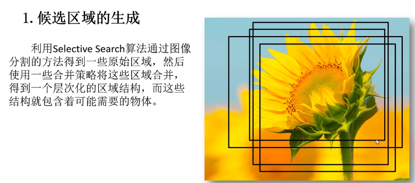

2. 对于每个候选区域，使用深度网络**提取特征**

   将每个候选框缩放到227×227pixel（Reset处理），接着将候选区域输入实现训练好的AlexNet CNN网络（图像分类），获取4096维的特征得到2000×4096维矩阵（我们把最后的全连接层去掉），4096每一行对应一个候选区域的特征向量

   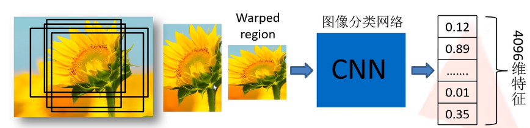

   

3. 特征送入每一类的SVM分类器，判别是否属于该类

   将2000×4096维特征与20个SVM组成的全职矩阵4096×20相乘，获得2000×20维矩阵中每一列即每一类进行非极大值抑制，提出重叠建议框，得到该列即该类中得分最高的一些建议框。所得结果就是对应类别的概率

   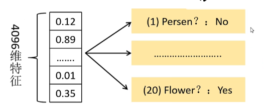

   **非极大值抑制：**

   - 寻找得分最高的目标
   - 计算其他目标与该目标的IOU
   - 删除所有IOU大于给定阈值的目标

   IOU：(A∩B)/(A∪B)

   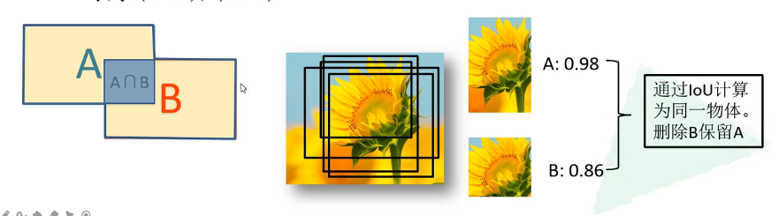

   为什么采用交并比而不是直接用MAX？考虑出现两个相似物体的情况。

4. 使用回归其精细修正候选框位置

   对NMS处理后剩余的建议框进一步筛选。接着分别用20个回归器对上述20个类别中剩余的建议框进行回归操作，最终得到每个类别修正后的得分最高的bounding box。

   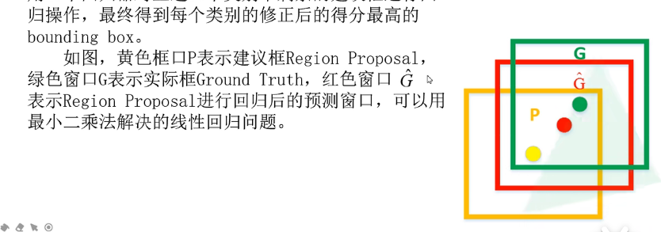

   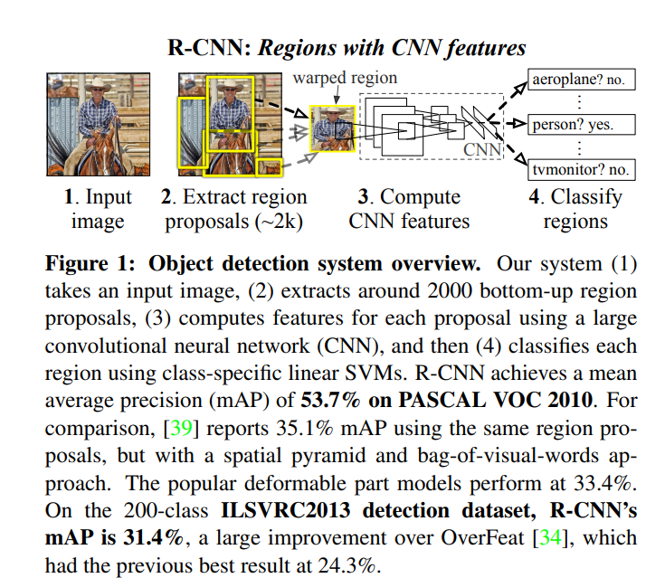

### RCNN框架：

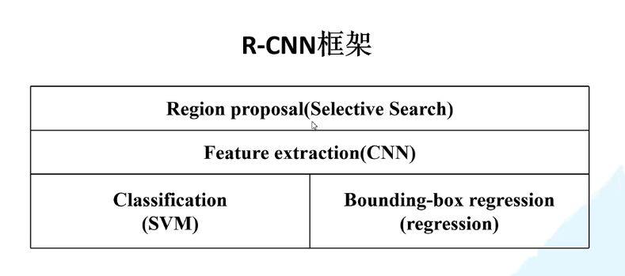

### RCNN存在的问题：

- 测试速度慢，测试一张图片约53s，用SS算法提取候选框用时约2s，一张图片中候选框存在大量重叠，提取特征操作冗余

- 训练速度慢

  过程及其繁琐

- 训练所需空间大

  对于SVM和bbox回归训练，需要从每个图像中的每个目标候选框提取特征，并写入磁盘。对于特别深的网络，如VGG16,从VOC07训练集上训练5K图像提取特征需要数百G的存储空间。

## FAST RCNN

对比RCNN，Fast RCNN同样使用VGG16作为网络backbone，但是训练时间比RCNN快了9倍，测试推理时间快了213倍，准确率从62%上升到66%（PASCAL VOC）。

### Fast RCNN训练步骤

1. 将一张图像划分为1000~2000个候选区域（Selective Search方法

2. 将一张图像输入网络得到对应的**特征图**，将SS算法生成的候选框投影到特征图上获得相应的特征矩阵

   **对比RCNN：**RCNN是将每个候选区域分别送入网络得到特征向量。而Fast RCNN是直接将整幅图像送入网络得到特征图，再将SS算法在原图上生成的候选区域映射到得到的特征图上，得到特征矩阵。

3. 将每个特征矩阵通过ROI_pooling(感兴趣区域Region of Interest)层缩放到7×7大小的特征图，接着将特征图展平通过一些列全连接层得到预测结果

   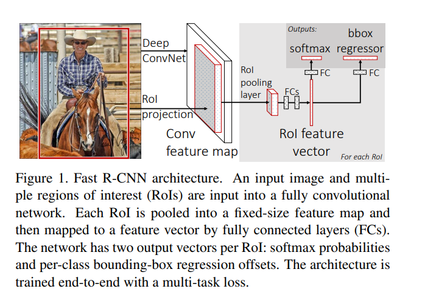

**RCNN生成特征方式：**

R-CNN一次将候选区域输入到卷积神经网络，得到特征

**Fast-RCNN生成特征：**

将整张图像送入网络，紧接着从特征图像上提取相应的候选区域。这些候选区域的特征不需要**重复的计算**。

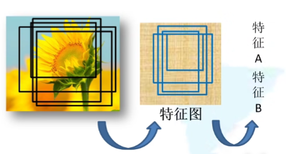

**数据采样：**

- 正样本：候选区域中包含目标
- 负样本：候选区域中不包含目标，例如背景等

为什么要有正/负样本：如果网络中没有负样本，在候选区域中，如果不包含要检测的对象，但是网络也可能仍会认为该区域就是要检测的对象。

**ROI Pooling Layer：**

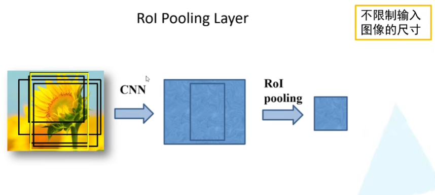

如图所示，我们得到训练样本之后，使用RoI pooling层统一设定输入大小。

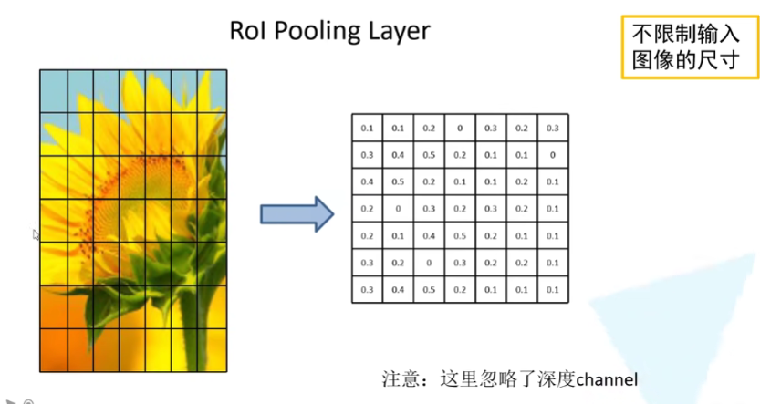

通过RoI将输入图像的尺寸缩放为7×7的特征图，这样就可以忽略输入图像的尺寸。

**分类器：**

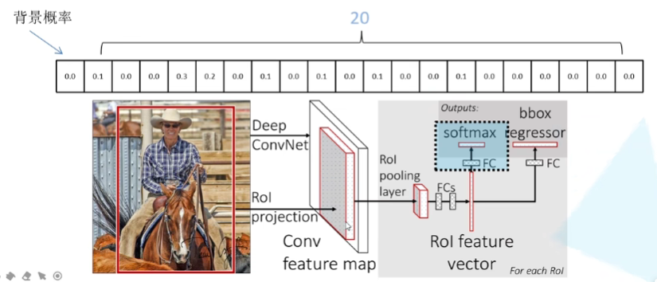

对特征向量进行展平，通过两个全连接层后，输入到两个部分：

- Softmax用于目标概率的预测

  输出N+1个类别的概率（N为检测目标的种类，1为背景）共N+1个节点

- regressor用于边界的回归预测

  输出对应N+1个类别的候选边界框回归参数(d~x~,d~y~,d~w~,d~h~)，共(N+1)×4个节点

**边界框回归器**

输出对应N+1个类别的候选边界框回归参数(d~x~,d~y~,d~w~,d~h~)，一共(N+1)×4个节点

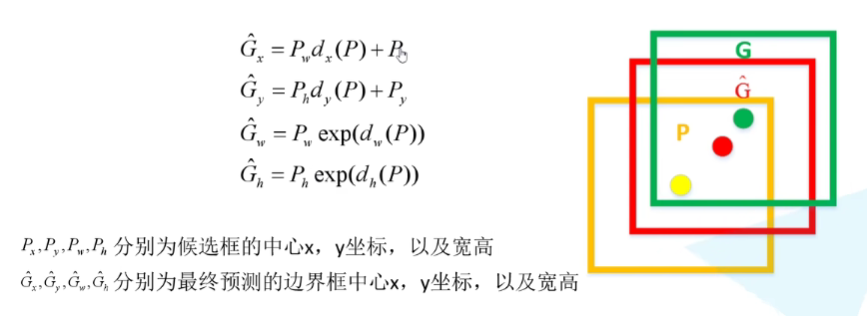

**损失计算 Multi-task loss**
$$
L(p,u,t^u,v)=L_{cls}(p,u)+\lambda [u≥1]L_{loc}(t^u,v)
$$
p是分类器预测的softmax概率分布p=(p~0~,...,p~k~)

u对应真实类别标签

t^u^对应边界框回归器预测的对应类别u的回归参数(t~x~^u^,t~y~^u^,t~w~^u^,t~h~^u^)

v对应真实目标的边界框回归参数(v~x~,v~y~,v~w~,v~h~)

- 分类损失$$L_{cls}(p,u)=-log p_u$$

- 边界框回归损失

  $$\lambda [u≥1]L_{loc}(t^u,v)$$

  其中$$L_{loc}(t^u,v)=Σ_{i∈(x,y,w,h)}smooth_{L_1}(t^u_i-v_i)$$

  $$smooth_{L_i}(x)=\begin{cases}0.5x^2\space if|x|＜1\\|x|-0.5\space otherwise\end{cases}$$

  [smooth损失参考资料](https://www.cnblogs.com/wangguchangqing/p/12021638.html)

  $$\lambda [u≥1]$$：λ是平衡系数，[u≥1]是艾弗森括号（满足条件对应正样本，不满足为副背景

**总结：**

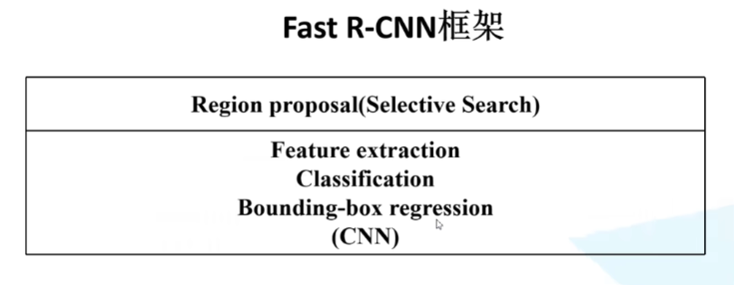

**SS算法是Fast RCNN的速度瓶颈**

## FASTER RCNN

同样使用VGG16作为网络的backbone，推理速度在GPU上达到5fps（包括候选区域的生成），同时准确率也有进一步提升。核心**RPN**.

### Faster RCNN步骤

1. 将图像输入到网络得到相应的特征图

2. 使用RPN结构生成候选框，将RPN生成的候选框投影到特征图上获得相应的**特征矩阵**

3. 将每个特征矩阵通过ROI pooling层缩放到**7×7大小的特征图**，接着将特征图照片通过一系列全连接层得到预测结果

   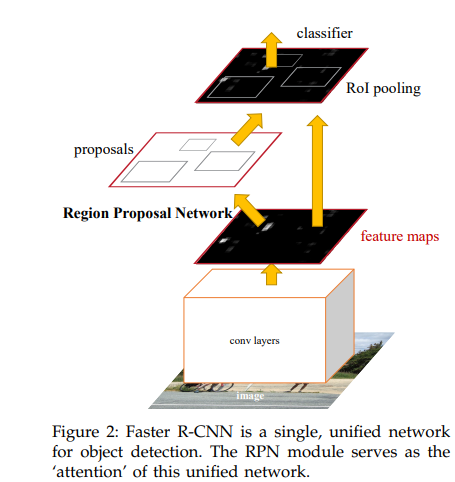

   如上图，在Faster RCNN中，使用Region Proposal Network(RPN结构)替代SS算法，而右边结构与Fast RCNN算法相同。

### RPN—Region Proposal Network

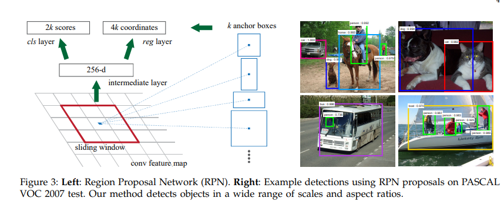

对于一张特征图，我们使用滑动窗口进行滑动（使用3×3卷积实现，步长=1），对于不同的滑动位置，我们生成一个一维的向量。将这个一维向量输出到两个全连接层：cls layer和reg layer。对于k个anchor boxes，我们生成2k个概率（该特征是背景和前景的概率）和4k个边界框回归参数。

**注：**生成一维向量元素个数是与使用的backbone基础深度有关的。

**anchor boxes：**

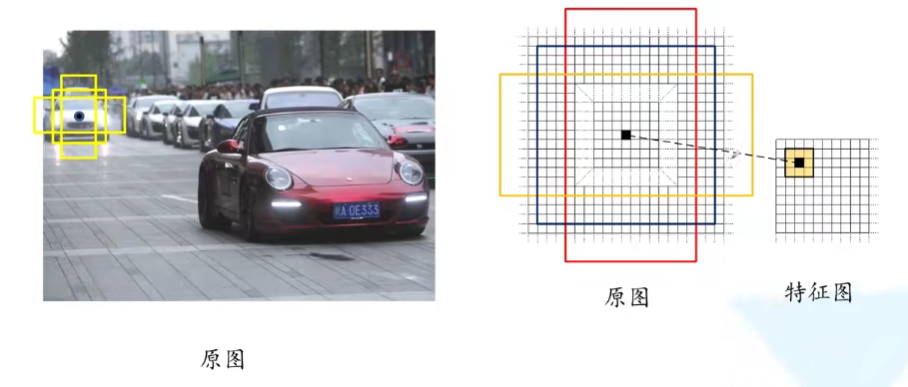

以某一点为中心，生成一系列anchor

对于cls：每两个值为一组，包含特征属于前景与背景的概率（不包含分类

对于reg：每四个值为一组，包含d~x~,d~y~,d~w~,d~h~（通过这四个回归参数，来预测不同目标的位置

**Faster-RCNN中的尺度和比例：**

- 三中尺度（面积）：128^2^,256^2^,512^2^——anchor面积
- 三种比例：1:1 , 1:2 ,2:1

每个位置上生成3×3=9个anchor

在实验中，ZF网络感受野是171，VGG网络感受野是228
$$
F(i)=(F(i+1)-1)×Strike+Ksize
$$
例如：对于一张1000×600×3的图像，大于有60×40×9（20k）个anchor，忽略跨越边界的anchor以后，剩下约6k个anchor。对于RPN生产的候选框之间存在大量重叠，基于候选框的cls得分，采用非极大值抑制，IoU设置为0.7，这样每张图片只剩2k个候选框。

### 正负样本的选取

对于每张图片生成的anchor，作者选取其中的256个进行正负样本的划分，比例大概1:1。如果正样本小于128，则将负样本作为正样本填充。正样本定义：

- anchor与ground-truth box重叠＞0.7
- anchor与ground-truth box重叠最大（应对存在不超过0.7的情况

### RPN Mutil-task loss

$$
L({p_i},{t_i})=\frac{1}{N_{cls}}Σ_iL_{cls}(p_i,p_i^*)+λ\frac{1}{N_{reg}}Σ_ip^*_iL_{reg}(t_i,t_i^*)
$$

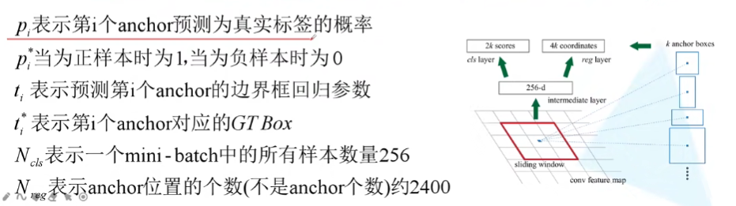

多分类的交叉熵损失 

- 分类损失
  $$
  L_{cls}=-[p_i^*log(p_i)+(1-p_i^*)log(1-p_i)]
  $$
  p~i~表示第i个anchor预测为目标的概率

  p~i~^*^，当为正样本时是1，负样本时是0

- 边界框回归损失

  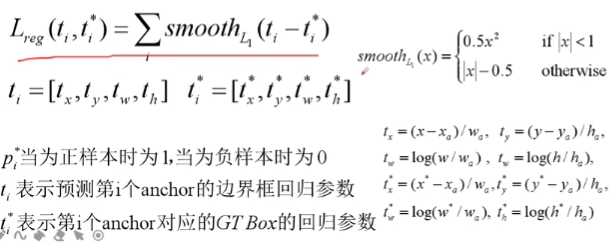

### 网络训练

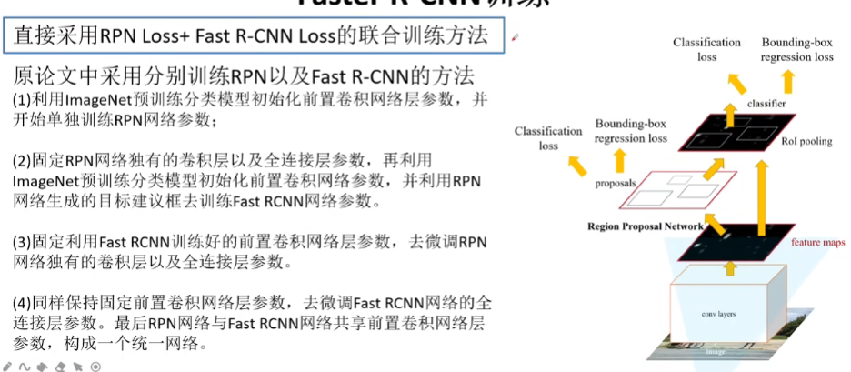

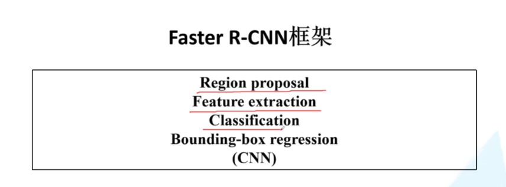

## SSD: Single Shot MultiBox Detector

2016年发表，对于输入尺寸为300×300的网络，使用Nvidia Titan X在VOC 2007测试集上达到74.3%mAP以及59FPS，对于512×512的网络，达到了76.9%mAP超越了当时的Faster RCNN(73.2%mAP)

**one stage**

在Faster RCNN中存在以下问题：

- 对小目标检测效果很差

  因为Faster RCNN只在一个特征层上进行预测，而这个特征层经过了许多个神经网络进行抽象，因此图像细节信息保留少。对于小目标，需要通过细节信息进行检测，因此Faster RCNN对于小目标

- 模型大，检测速度慢

  在预测过程中RPN进行预测，在Fast RCNN中也存在预测。

### SSD理论

#### SSD网络结构

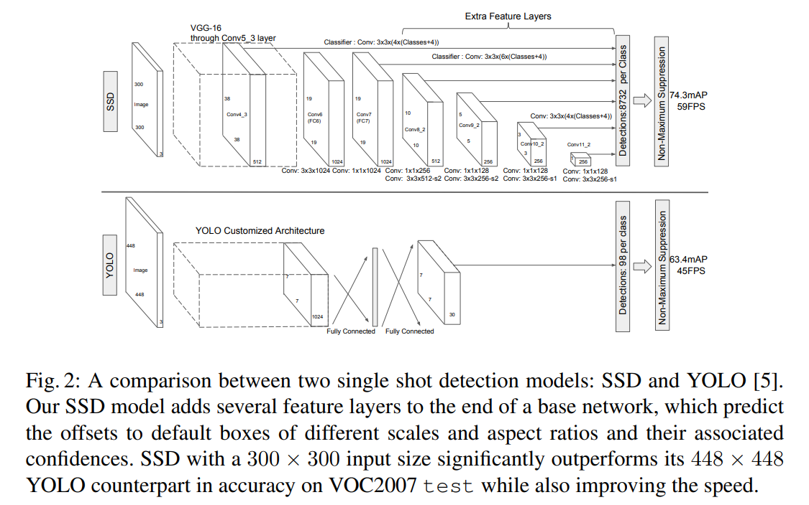

如上层结构所示，网络大小为300×300，backbone是VGG-16（直到Conv_5的第三层）。由上图可以看到，一共有6个预测特征层（6条横线引出的箭头），第一层预测特征层是VGG中的Conv4_3，以此类推。同时，不同特征层，检测的目标不同，对于前面的特征层，由于图像细节没有丢失，因此使用前面的特征层检测较小的目标，随着抽象程度加深（神经网络深度增加），后面的预测层用来检测大的物体。如下图：

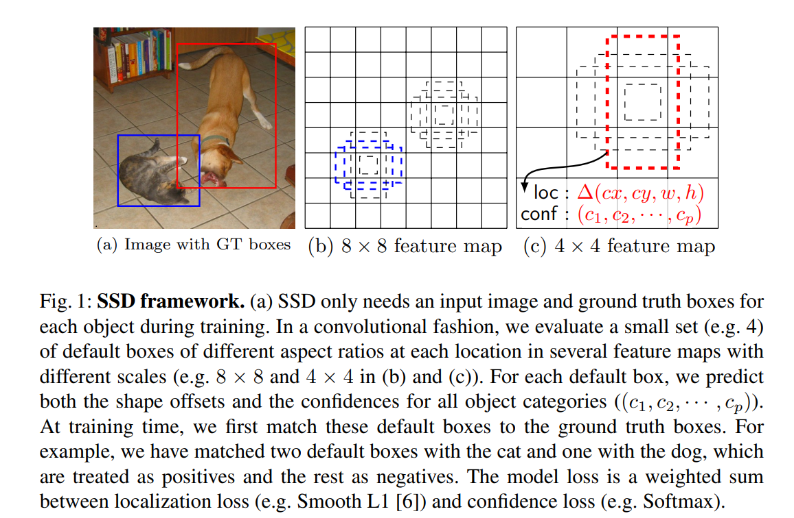

对于上图，我们得到了两个特征矩阵，一个是大小为8×8的特征矩阵，一个是大小为4×4的特征矩阵。对比4×4的特征矩阵，8×8的抽象程度更低，因此保留的细节信息更多。我们会在相对低层的网络上预测小的物体，对比原图，狗占的面积更大，猫占的面积更小，因此我们使用8×8的特征矩阵来对猫进行预测，而4×4的特征矩阵预测狗。

#### Default BOX尺度以及比例的设定

在原论文中，作者给出了如何计算。但是论文中的算法和实际应用的有一些区别

- scale
  $$
  scale=
  \left[\begin{array}{1}
  (21,45)\\
  (45,99)\\
  (99,153)\\
  (153,207)\\
  (207,261)\\
  (261,315)
  \end{array}\right]
  $$

- aspect
  $$
  aspect=
  \left[\begin{array}{1}
  (1,2,0.5)\\
  (1,2,0.5,3,1/3)\\
  (1,2,0.5,3,1/3)\\
  (1,2,0.5,3,1/3)\\
  (1,2,0.5)\\
  (1,2,0.5)
  \end{array}\right]
  $$
  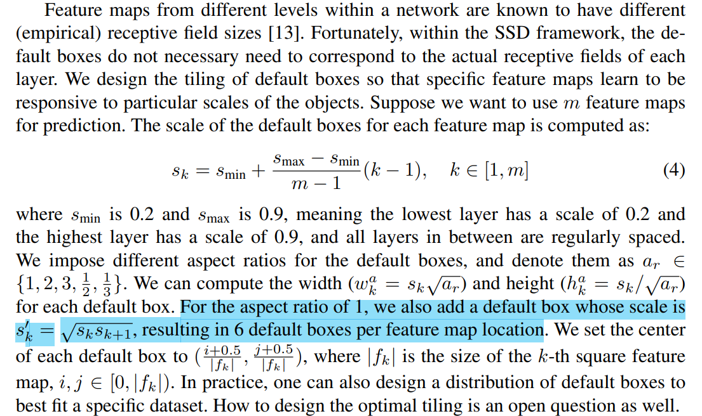

  在原论文中，s~k~对应scale中元素的第一维，s~k+1~对应第二维。同时，对于第1，5，6三个预测特征层，使用四个default box进行输出，其他特征层使用6个default进行输出。

  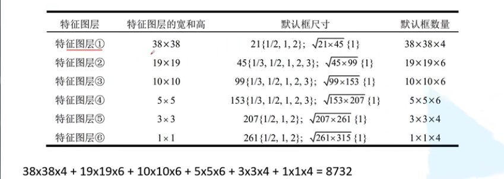

一共8732个default box，对应SSD结构最后的8732个输入

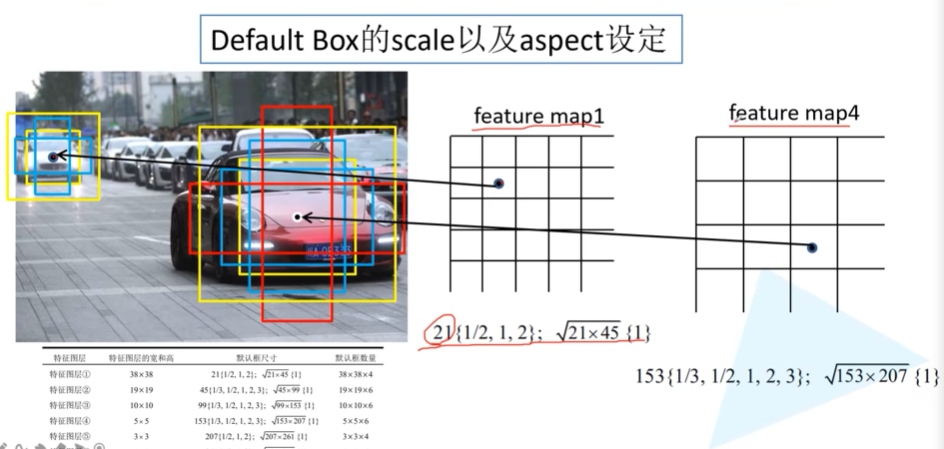

#### Predictor的实现

通过6个预测特征矩阵进行预测。在原论文中，每个添加的特征层（或者是可选的现存的来源于基网络的特征层）可以生成一个固定的预测结果的集合。对于一个大小为m×n的特征层，如果有p个通道，这些基本的预测参数，使用卷积核为3×3×p来生成概率分数和与default box关联的偏移坐标。

对于特征图上的每一个位置，生成k个default box，对于每一个default box我们估计c个类别分数和4个坐标偏移。因此，我们一共需要(c+4)*k个卷积核进行处理。对于一个大小为m×n的特征图，我们最后的计算量为$$(c+4)×kmn$$

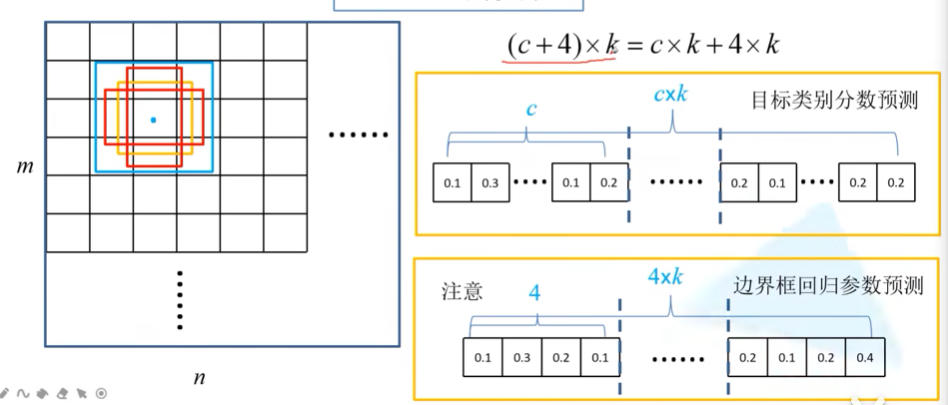

如上图所示，c×k表示每个default对应的类别分数（包括背景类别，背景概率）；4k表示每个default box对应的边界框回归参数（中心坐标x,y，高度w，宽度h）。**在Faster RCNN中，针对每个类别生成一个边界框回归参数，因此是有4c个参数**

#### 正样本

- 对于每个groundtruth box，匹配IoU最大的default box
- IoU>0.5的进行匹配（对于任意的default box

#### 负样本

- 定义正样本后，不属于正样本的为负样本
- 但实际上，负样本量很大，训练时会引入非常不平衡的状况。因此需要对负样本计算confidence loss，选取排在前面的添加到正样本。论文中，负样本：正样本=3:1（Hard negative mining）

#### 损失计算

$$
L(x,c,l,g)=\frac{1}{N}(L_{conf}(x,c)+αL_{loc}(x,l,g))
$$

损失包含分类损失+定位损失，其中N是匹配的正样本个数，α=1（平衡系数）

- 类别损失

  正样本类别损失+负样本类别损失，实质上是softmax loss

  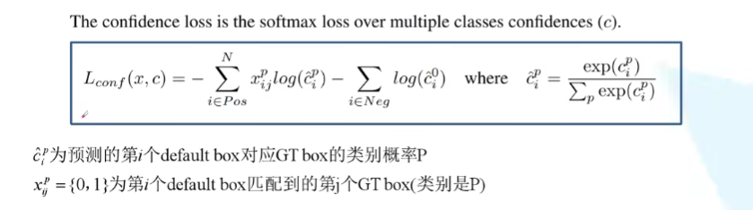

  第一部分，正样本类别损失；第二部分，负样本类别损失

- 定位损失

  只针对正样本而言，不对负样本计算

  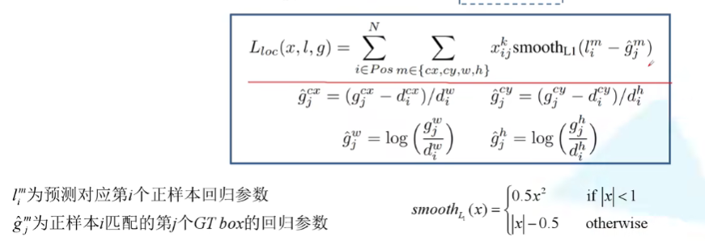

### SSD实践

代码主要依据英伟达的SSD源码进行修改

#### Model Overview

算法主要参考SSD论文，但是不同之处在于backbone的选取：在原论文中，特征提取网络是基于VGG模型，但是在英伟达给出的网络中backbone是基于ResNet-50模型。输入图像大大小固定在300×300.

模型增强处理：

- conv5_x,avgpool,fc和softmax layers从原始模型中移除

- 多有conv4_x的步长设置为1×1

  对特征矩阵的高和宽产生影响，但是深度没影响

  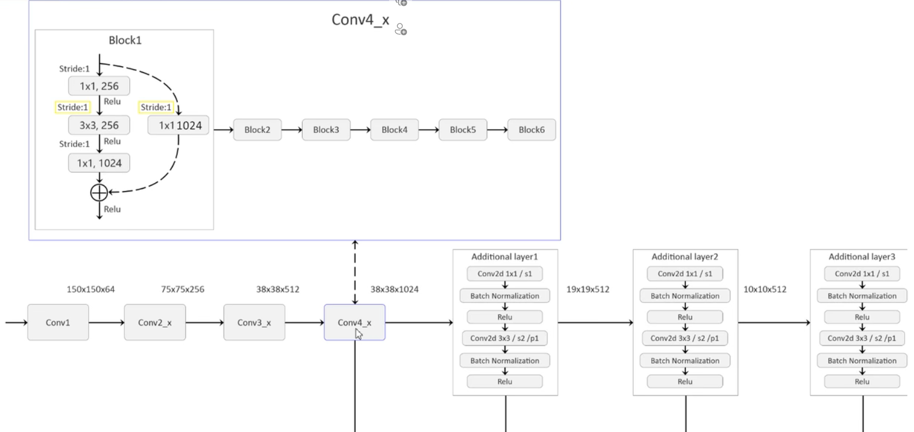

- 后面添加5个新的层结构，生成更多的预测特征层

  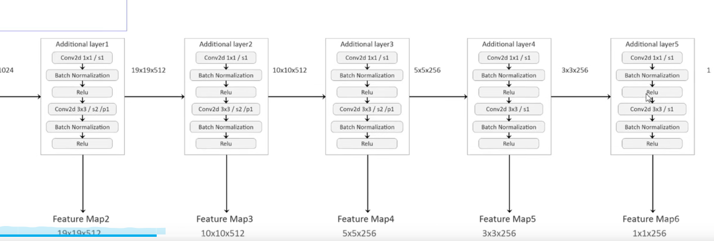

Detector和原论文一样，使用了英伟达dali的包，这样就可以使用GPU对数据进行预处理。（GPU速度比CPU快，一般情况下，GPU要等待CPU进行

混合精度：

在训练网络过程中，我们的模型使用的是float32的数据类型。添加了混合精度，我们会使用float16+float32一起进行训练，因为引入float16，训练时间加速，但是相对而言运算精度会降低。

#### 数据集 Pascal Voc 2012

该数据集包括：分类，目标检测，图像分割（实例分割和语义分割），行为检测等任务

一共 20 个类别：

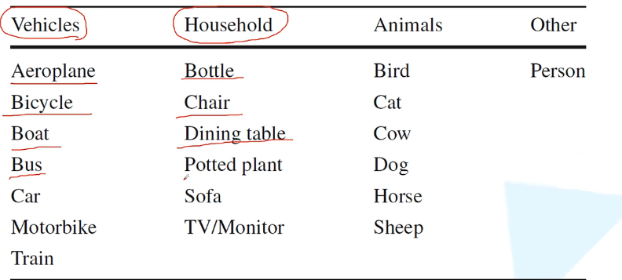

- 文件结构：

  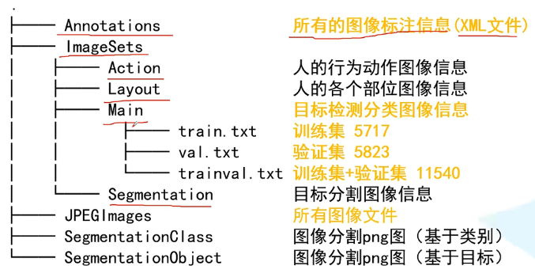

  txt文件中，对应一个图像的名称

#### 搭建SSD

## Yolo系列

### Yolo V1

you only look once

- unified
- one stage
- end to end

一个模型处理两个子任务：

1. object 的 bounding box 的 位置信息
2. bbox对应的类别信息

将一幅图像分成S×S个网格grid cell，如果某个object的中心落在这个网格中，这个网格就负责预测这个object

每个grid cell预测B个bounding box，每个Boundingbox除了预测位置之外，还要附带一个confidence，每个网格还要预测C个类别的分数

#### 测试阶段

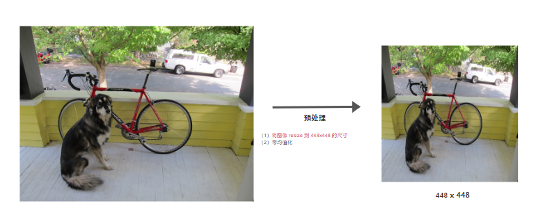

- 预处理，resize到448*448大小，同时进行零均值化

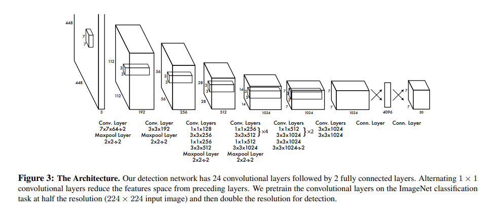

网络结构如上，最后得到7×7×30的矩阵：

- 我们把输入图像分割为7×7一共49个小格，每个小格称为一个grid cell，输出的7×7的每一块就是原输入的每一个grid cell的信息

  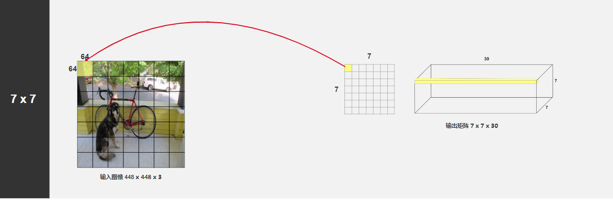

- 通道数为什么为30？

  1. ground truth bbox的中心点落在哪一个grid cell，那么这个grid cell就负责预测这个物体
  2. 每个grid cell 预测两个bounding box
  3. 2个bbox共用一套条件类别概率

  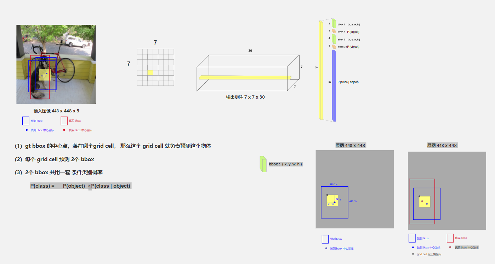

  30包含(已经归一化了)：第一个bbox(x,y,w,h)，第一个bbox的类别；第二个bbox(x,y,w,h)，第二个bbox的类别;P(class|object)，在使用PASCAL VOC数据集（20类），每个类别的概率是多少

  x * 64 和 y * 64得到原图像的中心点相对于grid cell左上角的坐标；w * 448 和 h * 448得到原图像的宽和高

因为有49个grid cell，每个grid cell 预测两个bbox，因此一共会得到98个bbox：

1. 筛选出P(object) > threshold1(0.1)的bboxes： contain_index , contain_prob

   （剔除包含物体概率小于0.1的，置信度太低，保留剩下的bbox，因此最后保留的bbox会很少）

2. 对于bbox的每一个box

   - 找到class probablity最大的类别：class_index , class_prob

   - 计算probs = contain_prob * class_prob（是否包含该物体的概率×类别的概率

   - 如果probs > threshold2 :

     记录bbox坐标 、 class_index 、probs

3. 计算NMS（非极大值抑制），筛选出一部分bbox

#### 训练阶段

1. 图像进行预处理（水平翻转、尺度调整，颜色增强，平移/裁剪，resize等），因此bbox的坐标也要进行调整，但是类别不用

2. 包含中心点的grid cell填充到输出的7 * 7 * 30

   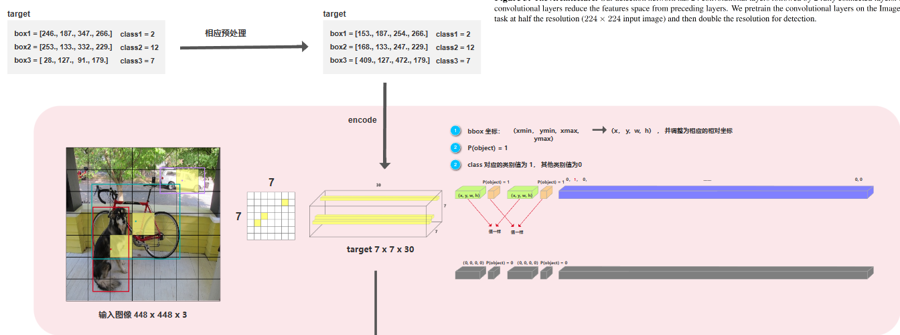

   只填充包含物体的，不包含的就不填充了

3. 计算损失函数

   - 定位损失（bbox中心点误差+高宽误差）

     开方求差值：考虑真实bbox与预测bbox之间存在一个偏移量，对于较大的bbox，即便出现偏移，但是真实值与预测值之间的交集相差不大；对于较小的bbox，这个差值会很大

     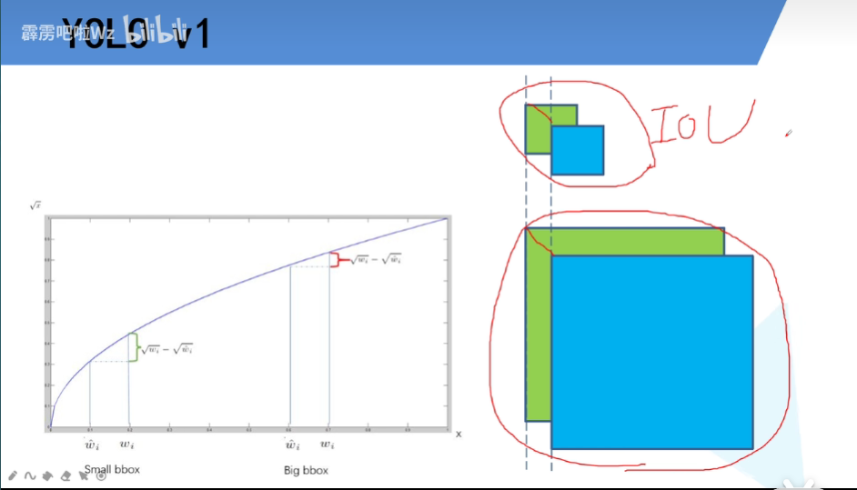

     如果没有开方，图中差值是一条直线，即偏移相同的距离时，小目标和大目标差值是一样的；但实时上小目标应该更大，所以使用先开根，在求解差值，如曲线所示。

   - 置信度损失（是否包含目标物体的置信度损失）：负责检测物体的bbox的置信度损失+不负责检测物体的bbox置信度损失
   
   - 类别损失
   
     检测物体的bbox的类别损失
   
   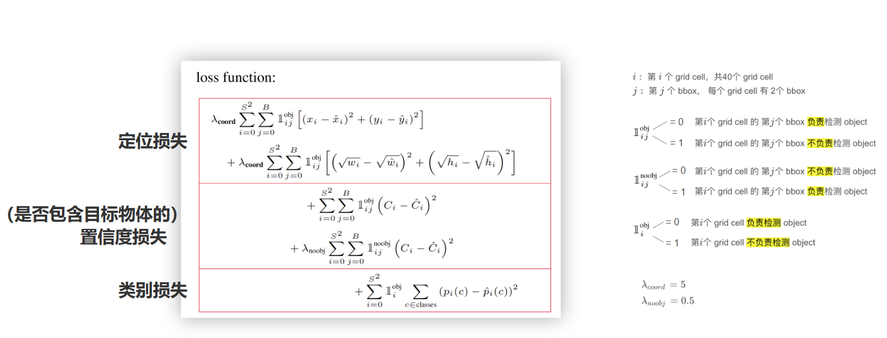

对群体性小目标检测差，出现新的尺寸或者配置，预测结果差

主要问题出现在**定位不准确**，之后使用anchor来解决这个问题

### YOLO V2 2016

#### 摘要

我们介绍了YOLO9000，新的实时的目标检测系统，之所以称之为9000是因为它能够检测超过9000中的物体类别。

1. 我们介绍了对于YOLO V1的改进，既有新添加的方法、也有先前工作驱动的。改进的模型 YOLOV2，在Pascal voc 和 COCO数据集上有很好的表现。使用一个新的，多尺度的方法，YOLOV2模型能够在不同尺度的任务中运行，在速度和准确性做出很好的权衡。
2. 之后，我们提出了一个方法关联目标检测和分类。使用这个方法我们同时训练YOLO9000在COCO目标检测数据集和图像分类数据集。

#### Introduction

当前目标检测框架算法越来越快速以及准确，大事多数方法仍然受限于一个小的物体集合。

在论文发表的时候，目标检测数据集对比分类任务数据集，数量是十分有限的。同时，专门为目标检测数据集进行标注花费是巨大的。

因此，作者提出了一个新的方法使用现有的分类数据集，并且扩大到当前的目标检测任务中。我们的方法使用了(hierarchical view of object classification)目标检测的分层视图，允许我们整个不同的数据集。

我们也提出了一个关联训练算法，这允许我们在目标检测数据集和分类任务数据集上训练目标检测器。我们的方法利用标记的检测图像来学习精确定位对象，同时使用分类图像来增加其词汇表的稳健性。

使用这个方法我们训练了YOLO9000,这是一个实时的目标检测器可以检测超过9000种的类别。首先，我们改进了基于YOLO的检测系统；之后，我们使用我们的数据集结合方法以及关联训练算法来训练超过9000种的图像分类，同时在COCO训练目标检测。

#### Better

YOLO有不同的缺点，对比Fast R-CNN展示了YOLO显著的定位误差。此外YOLO对于region proposal-based算法有更低的召回率。因此我们关注的主要在改进召回率和定位（在保持分类准确性的基础上）

计算机视觉倾向于更大、更深的网络[6] [18] [17]。更好的性能与训练更大的网络和组合多种模型相关联。然而，YOLO V2我们希望一个更准确的检测器并且保持速度。因此，我们并没有增加我们网络的尺度，我们简化网络之后使得表达更容易学习。我们根据先前工作提出了不同的想法来改进我们的工作。

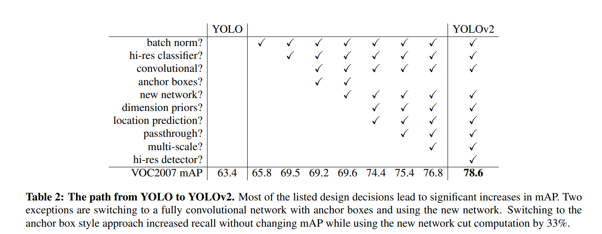

- Batche Normalization

  BN能够显著改进收敛性质，在消除其他形式正则化regularization[7]。通过加入BN在所有YOLO中的卷积层，我们得到了2%的mAP提高。BN也帮助regularize正则模型。使用BN我们可以删除dropout，并且不会导致过拟合。

- High Resolution Classifier

  当前所有先进的检测算法都是使用在ImageNet上进行分类预训练[16]。从AlexNet开始，多数分类操作的输入为256×256甚至更小。最初的YOLO悬链分类网络在224×224的尺度上，并且增加分辨率到448用于目标检测，这意味着网络不得不同时转为学习目标检测以及适应最新的输入分辨率。

  对于YOLO V2，我们首先微调了在ImageNet上的10个epoches的448×448的图像分辨率。我们之后微调了在目标检测上的网络结果。高分辨率分类网络给我们增加了4%的mAP。

- Convolutional With Anchor Boxes

  YOLO直接在卷积层特征提取器最顶端使用全连接层预测了bounding box坐标。不是像Faster R-CNN实际使用手动选择的priors[15]来预测坐标。只使用卷积层的RPN（region proposal netwok）在Faster R-CNN预测和提供了每个锚框anchor box的偏移和置信度。因为预测层是卷积层，RPN预测这些偏移在每个特征图上的每次定位。预测偏移而不是简化坐标问题，使得网络更容易学习。

  我们移除了来自YOLO的全连接层，并且使用anchor box来预测边界框。首先，我们消除一个池化层来使得用于输出的卷积神经网络能够输出更高分辨率的图像。我们也缩减了网络来对416大小的图像进行操作而不是448×448.我们这么做因为我们想要特征图中具有奇数个位置因此，保证一个单中心的区域。物体，特别是大物体，更容易占据图像中心，因此使用一个在中心点定位预测这些物体会比使用四个周围参数来预测更好。YOLO的卷积层下采样32被，因此最后我们得到13×13的图像。

  当我们移动锚框的时候，我们也从空间定位中分离了物体预测机制（解耦合），预测每个锚盒的类和物体位姿。同YOLO V1一样，目标检测仍然预测ground truth的IOU和提出的box，分类与此目标物体是某种类别的概率。

  使用anchor boxes我们的准确性得到了较小幅度的提升。YOLO仅仅预测了98个boxed(每个图像中)但是使用anchor boxes我们得到了上千个预测结果。没有狂魔我们得到的是69.5mAP和81%的召回率。使用anchor boxes我们得到了69.2的mAP召回率到了88%。及时mAP略有下降，但是增加的召回率意味着我们模型能够有更好的改进。

- Dimension Clusters