# 语义分割

分割任务：

- 语义分割

  对像素进行分类，例如FCN

- 实例分割

  Msak R-CNN

- 全景分割

  Panoptic FPN

## 数据集格式

### Pascal VOC

提供PNG图片，调色板模式存储（单通道，0~255，每个值表示一个值，可以相当于映射到彩色图像值域），对于225的区域算为目标边缘，这里我们认为这是边缘区域，不计算该区域损失。

关于[Pascal Voc](https://blog.csdn.net/qq_37541097/article/details/115787033?ops_request_misc=%257B%2522request%255Fid%2522%253A%2522168077227516782425117572%2522%252C%2522scm%2522%253A%252220140713.130102334.pc%255Fblog.%2522%257D&request_id=168077227516782425117572&biz_id=0&utm_medium=distribute.pc_search_result.none-task-blog-2~blog~first_rank_ecpm_v1~rank_v31_ecpm-1-115787033-null-null.blog_rank_default&utm_term=Pascal&spm=1018.2226.3001.4450)

### MS COCO

针对图像中的每一个目标都记录了多边形坐标，不仅可以用于语义分割，也可以用于实例分割

关于[MS COCO](https://blog.csdn.net/qq_37541097/article/details/113247318?ops_request_misc=%257B%2522request%255Fid%2522%253A%2522168077252416782427418673%2522%252C%2522scm%2522%253A%252220140713.130102334.pc%255Fblog.%2522%257D&request_id=168077252416782427418673&biz_id=0&utm_medium=distribute.pc_search_result.none-task-blog-2~blog~first_rank_ecpm_v1~rank_v31_ecpm-1-113247318-null-null.blog_rank_default&utm_term=MS&spm=1018.2226.3001.4450)

## 得到的结果

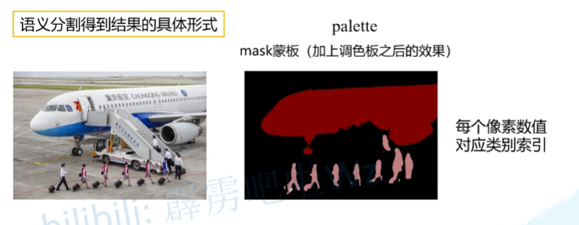

不用灰度图：因为得到的结果（分割的区域像素值很小）非常接近黑色，因此很难辨认分割区域

## 评价指标

- pixel accuracy（分子：正确预测像素总和；分母：所有像素
  $$
  \frac{Σ_in_{ii}}{Σ_it_i}
  $$

- mean accuracy（将每一个类别准确度计算求和取平均
  $$
  \frac{1}{n_{cls}}·Σ_i\frac{n_{ii}}{t_i}
  $$

- mean IoU（
  $$
  \frac{1}{n_{cls}}·Σ_i\frac{n_{ii}}{t_i+Σ_jn_{ji}-n_{ii}}
  $$

$$n_{ij}$$：类别i被预测成类别j的像素个数

$$n_{cls}$$：目标类别个数（包含背景）

$$t_i=Σ_jn_{ij}：$$目标类别i的总像素个数（真实标签）

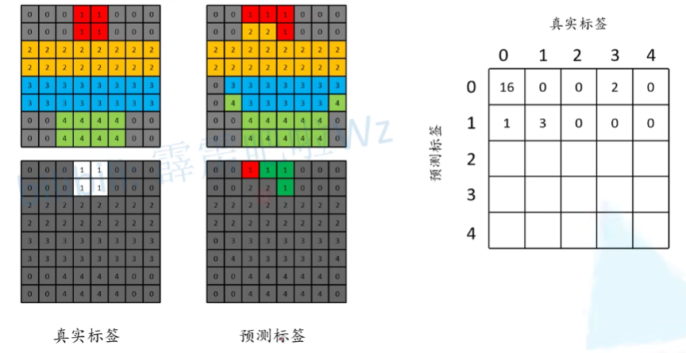

如图所示，左上表示真实标签，右上表示预测标签

右下方图中，绿色表示正确预测，红色表示错误预测。可以看到，有三个正确预测为1，有一个将0预测为1，对应最右边的结果如图。以此类推，最后得到：

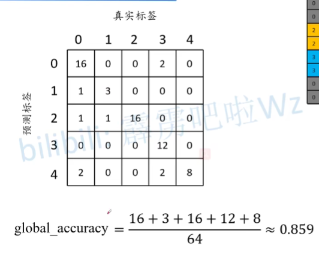

分子，预测正确的像素个数，即上图矩阵的迹，分母是矩阵大小。

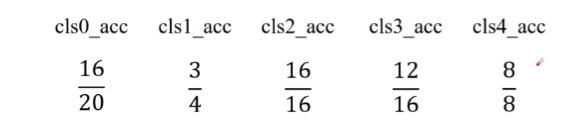

每列数字之和：某一类的总数。

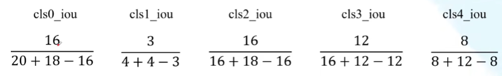

分母：真实总个数+预测总个数-分子

分子：正确预测个数

## 一些标注工具

[Labelme](https://github.com/wkentaro/labelme)

[EIseg](https://github.com/PaddlePaddle/PaddleSeg)

## 转置卷积（Transposed Convolution

- 不是卷积的逆运算
- 转置卷积也是卷积

转置卷积可以用于**上采样**，[关于其他卷积的介绍](https://arxiv.org/abs/1603.07285)。例如，在使用VGG作为backbone，我们

### 运算步骤：

- stride=1（恒定

- 在输入特征图元素间填充s-1行，列

- 在输入特征图四周填充k-p-1行，列

- 将卷积核参数上下、左右翻转

- 做正常卷积运算（填充0，步长1）

  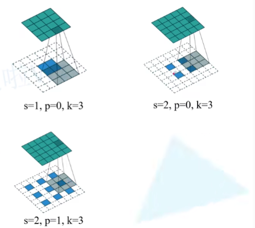

[图片参考](https://github.com/vdumoulin/conv_arithmetic)

转置卷积是上采样，输出大图像，输入小图像。我们把输入输出调换，假设输入大图像，输出小图像。s是大图像得到小图像所需的kernel的步长，k是所需的卷积核大小，p是所需的padding。这样的s,k,p用于input的填充计算。

**已知input和kernel，求解output**

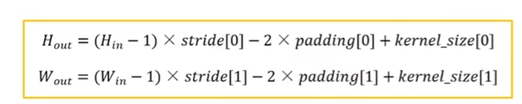

 在pytorch中，ConvTranspose2d，****

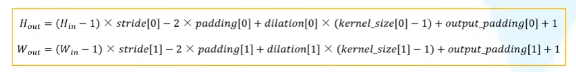

### 计算方式：

- 将卷积核转换成等效矩阵

  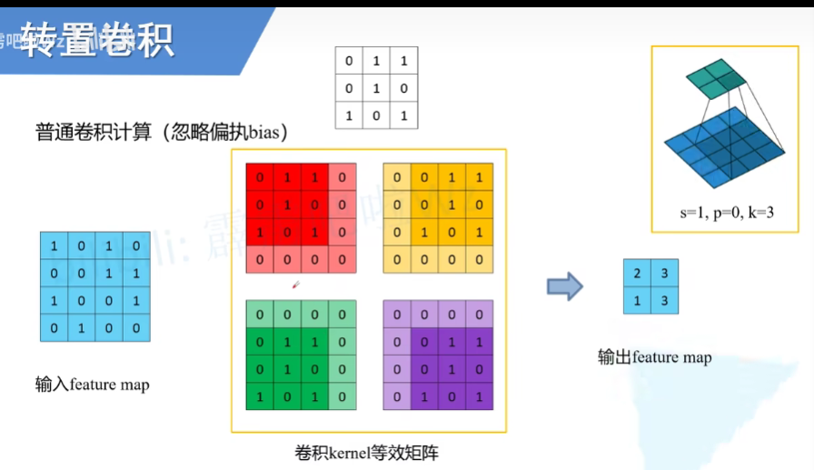

- 展平输入featuremap，得到列向量I

  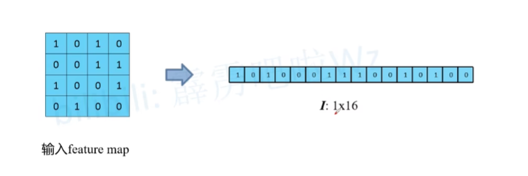

- 将等效矩阵展平后构建列向量，构建一个矩阵C

  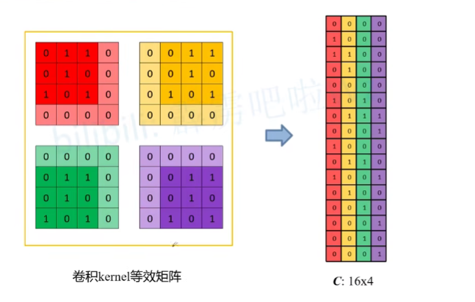

- 矩阵I与矩阵C相乘得到矩阵O

因为上述过程中，矩阵非逆，因此无法通过C和O还原I；但是可以还原得到一个跟I大小相同的向量P（等号两端同时乘C^T^），再将这个矩阵还原为2D

如果我们将C的转置按列写成等效矩阵：

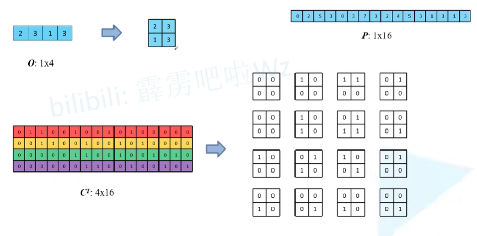

每个等效矩阵与O相乘相加，可以得到P对应位置的元素

## 损失计算：Cross Entropy Loss

计算每个像素的交叉熵损失，之后对所有交叉熵损失求和求平均。

## FCN

[参考资料](https://p9gjn0.axshare.com/?g=1&id=lv2bon&p=%E8%86%A8%E8%83%80%E5%8D%B7%E7%A7%AF)

FCN是首个端对端针对像素级预测的全卷积网络，将卷积层最后的全连接层替换为卷积层。

在摘要中，1、FCN是一个端到端的（给一个输入，输出就是语义分割的结果），像素到像素的处理方式（输入多大的图像，输出多大的图像）。2、网络结构是一个全卷积网络，fully convolution，即网络内部是全部是卷积层，而不是全连接层。（原因是全连接层固定了网络尺寸大小，如果只使用卷积层，则避免了这个问题）。3、作者使用了当前分类网络，如AlexNet，VGG，GoogleNet等分类网络，在此基础上对网络进行调整。4、定义了跨层的结构skip architecture，越接近原图像，表达更为浅层/底层的信息，随着网络的加深，越到最后，越高层的feature map表示图像的语义信息（图像的语义是什么，但是无法展示细节）。

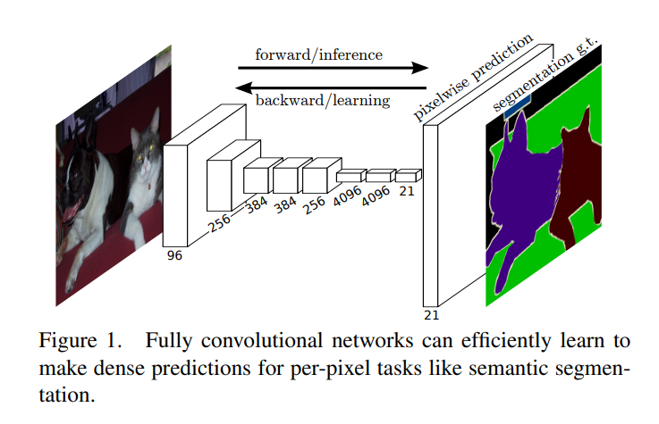

如上图所示，FCN的结构可以划分为一系列的卷积+采样层。

- 如果最后是FC层，我们可以通过softmax得到每一类的概率，完成分类任务（认为最高概率为目标类）。但是我们对输入网络图片大小有严格的限制。
- 如果换成卷积层，我们对输入网络图片大小就没有那么严格的限制了。采用卷积层之后，输入图像大小如果＞24 * 24，那么我们最终得到的图像的特征层高度和宽度 > 1。之后，对应每一个channel的数据是2D的数据。

### VGG16模型

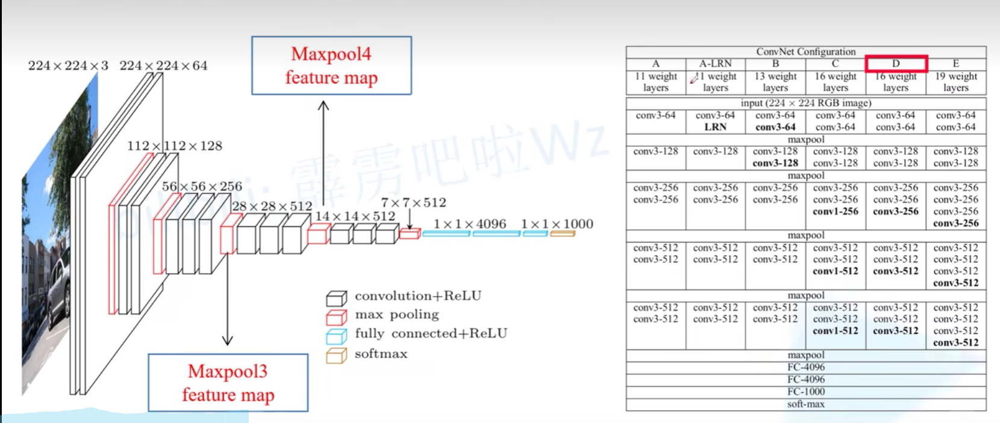

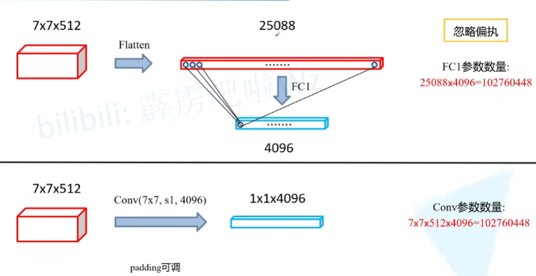

- 分类网络

  我们对得到的结果首先进行展平处理，由上图可以看到，展平后的一维向量大小为25088，通过全连接层，输出每个节点与输入每个节点进行全连接，每个全连接有一个权重，所以一共有25088×4096的权重。

- 不使用全连接层

  我们的卷积核大小为7×7，通道数为4096，步长为1

  对于一个卷积核，参数7×7×512×4096，和全连接层一样

### FCN-32s

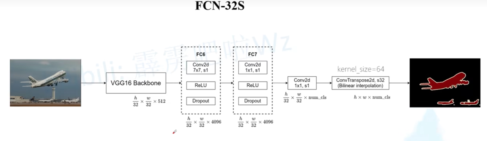

在原文中：padding设置为100，原因：输入图片大小小于192×192时，VGG最后一层卷积层的图像高和宽<7×7，这样运算过程中会报错。更极端一些，如果图像大小＜32×32（因为我们bcakbone通常是下采样32倍），那么我们没有通过backbone就报错了。

在实际过程中：我们很少对32×32这么小的图像进行语义分割。因此这样的极端情况很少出现，一般我们不做考虑。因此通常，padding设置为3，就可训练任意高宽大于32×32的图片。同时，padding设置为100会增大网络计算量，同时在进行上采样之后，我们需要进行裁剪。

- VGG16（不包含最后全连接层）作为backbone

- FC6和FC7，用卷积层替换全连接层

- Conv2d包含背景，通道数是num_class

- 转置卷积上采样32倍，恢复到原图的大小，使用[双线性插值](https://blog.csdn.net/qq_37541097/article/details/112564822?ops_request_misc=%257B%2522request%255Fid%2522%253A%2522168111566316800188585339%2522%252C%2522scm%2522%253A%252220140713.130102334.pc%255Fblog.%2522%257D&request_id=168111566316800188585339&biz_id=0&utm_medium=distribute.pc_search_result.none-task-blog-2~blog~first_rank_ecpm_v1~rank_v31_ecpm-1-112564822-null-null.blog_rank_default&utm_term=%E5%8F%8C%E7%BA%BF%E6%80%A7%E6%8F%92%E5%80%BC&spm=1018.2226.3001.4450)参数初始化转置卷积参数

  在原论文中，作者冻结了转置卷积的参数，因为作者在实践中发现了冻结和不冻结时，实验结果差别不大，冻结的话网络训练过程加速了。**效果不明显的原因可能是一次性上采样32倍，上采样率太大**

### FCN-16S

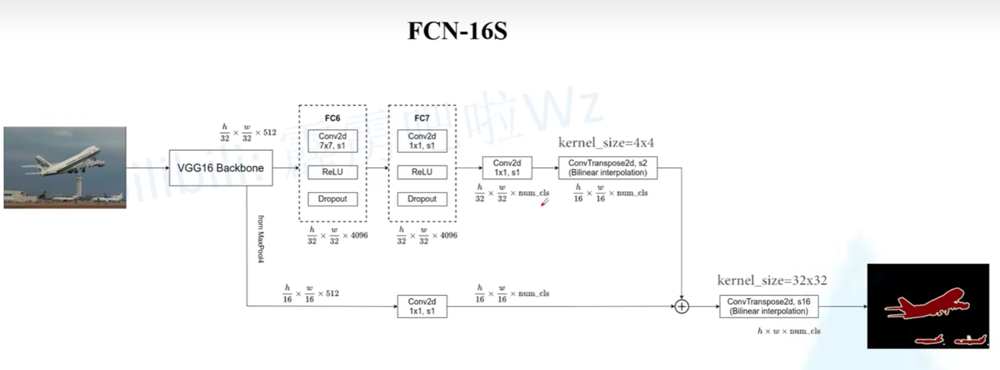

对比FCN-32S，上面一条线通过转置卷积将下采样32倍的图像上采样2倍；下面一条线通过Maxpooling下采样变为$$\frac{1}{16}$$，最后将上下结果相加，在进行转置卷积上采样16倍。

### FCN-8S

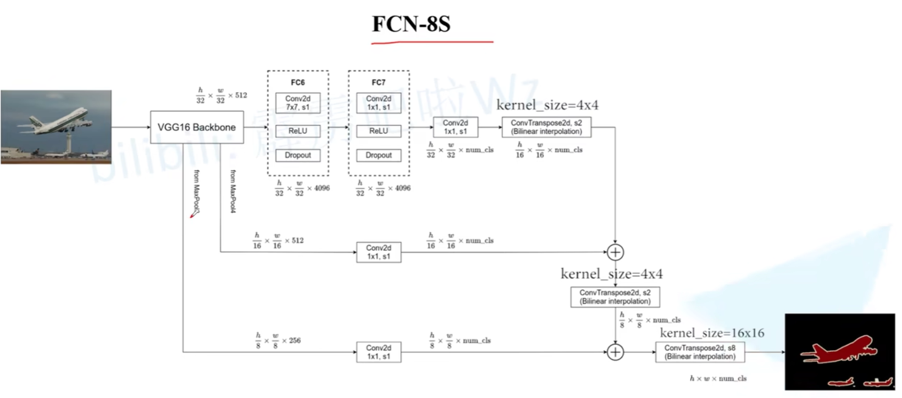

我们使用了VGG16中Maxpooling3，其他过程同FCN-16S

**三个模型的差别**

## 膨胀(空洞卷积)卷积

<figure class="half">
    
    
</figure>

普通卷积计算式连续像素，膨胀卷积计算是间隔像素。

- 增大感受野，输出图像的每个像素包含更大范围的图像信息
- 保持输入特征图的宽W和高H

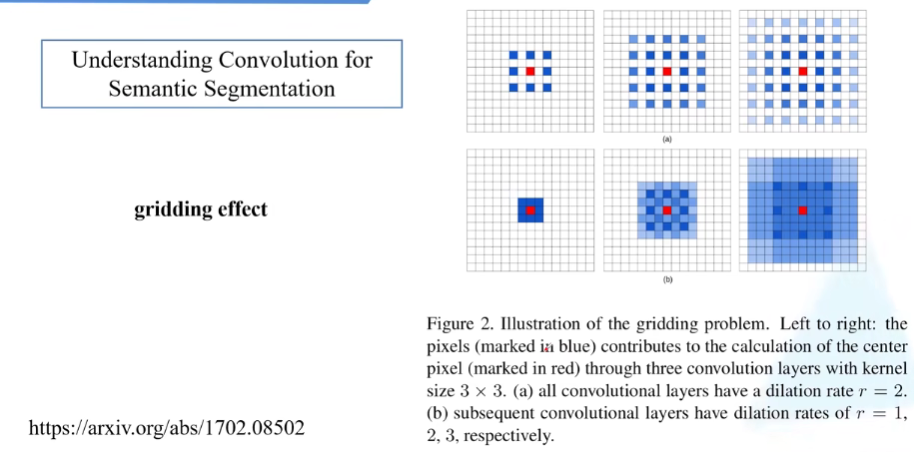

缺点：网格效应，因为膨胀卷积是一种稀疏的采集方式，多个膨胀卷积叠加式（连续使用膨胀卷积），有些像素没有被使用到，这样会损失信息的连续性与相关性，进而影响分割、检测等要求较高的任务。**因此，需要避免连续使用膨胀卷积**

### gridding effect[论文地址](https://arxiv.org/abs/1702.08502)

## FCN 代码实现

[源码地址](https://github.com/pytorch/vision/tree/main/torchvision/models/segmentation)

### 环境配置

- python3.10(anacoda)
- pytorch
- Ubuntu或者Centos（Windows暂不支持多GPU训练
- 最好使用GPU训练

### 文件结构：

  ├── src: 模型的backbone以及FCN的搭建
  ├── train_utils: 训练、验证以及多GPU训练相关模块
  ├── my_dataset.py: 自定义dataset用于读取VOC数据集
  ├── train.py: 以fcn_resnet50(这里使用了Dilated/Atrous Convolution)进行训练
  ├── train_multi_GPU.py: 针对使用多GPU的用户使用
  ├── predict.py: 简易的预测脚本，使用训练好的权重进行预测测试
  ├── validation.py: 利用训练好的权重验证/测试数据的mIoU等指标，并生成record_mAP.txt文件
  └── pascal_voc_classes.json: pascal_voc标签文件

### 预训练权重

[fcn_resnet 50](https://download.pytorch.org/models/fcn_resnet50_coco-1167a1af.pth)

[fcn_resnet 101](https://download.pytorch.org/models/fcn_resnet101_coco-7ecb50ca.pth)

**注：**官方提供的预训练权重是在coco上预训练得到的，训练时只针对和PASCAL VOC相同的类别进行了训练，所以类别数（包含背景）一共是21

下载预训练权重要重命名，例如：train.py中读取的是`fcn_resnet50_coco.pth`文件， 不是`fcn_resnet50_coco-1167a1af.pth`

### FCN官方结构图

代码分为三个部分，训练、验证、预测

train框架：

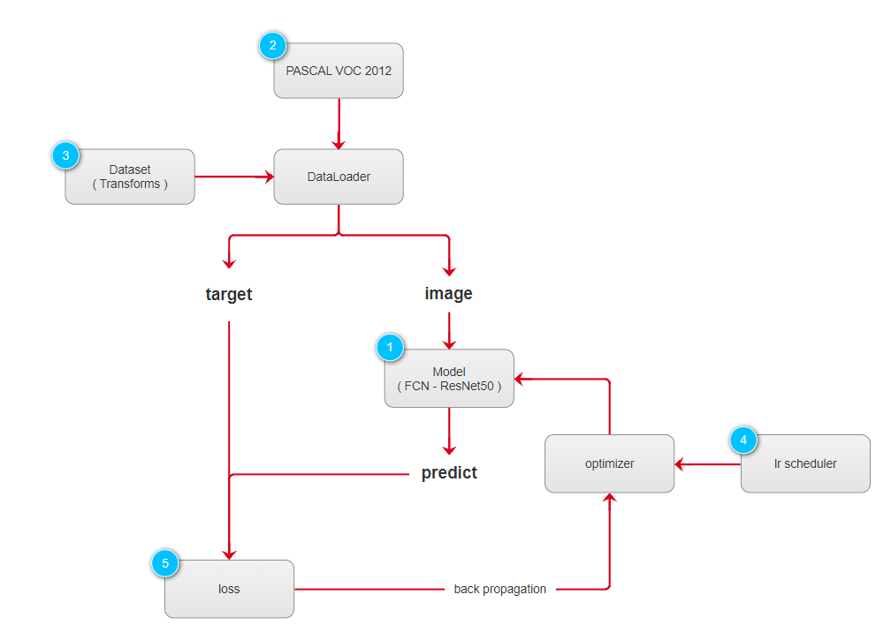

evalution框架：

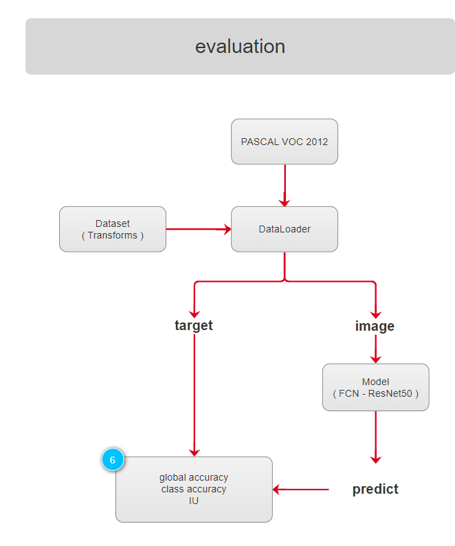

predict框架：

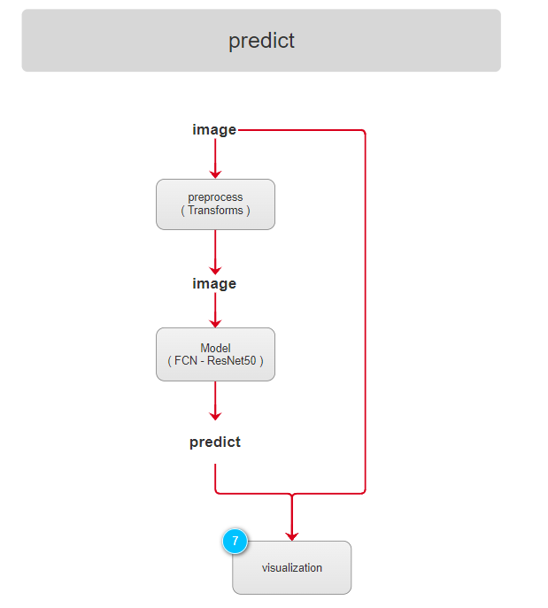

### 网络搭建

ResNet-50修改

FCN网络搭建：

搭建代码位于backbone.py和fcn.py两个文件中

- backbone.py：构造resnet 50
- fcn.py：对构造的resnet50进行修改

自定义数据集：

修改mydataset.py文件参数