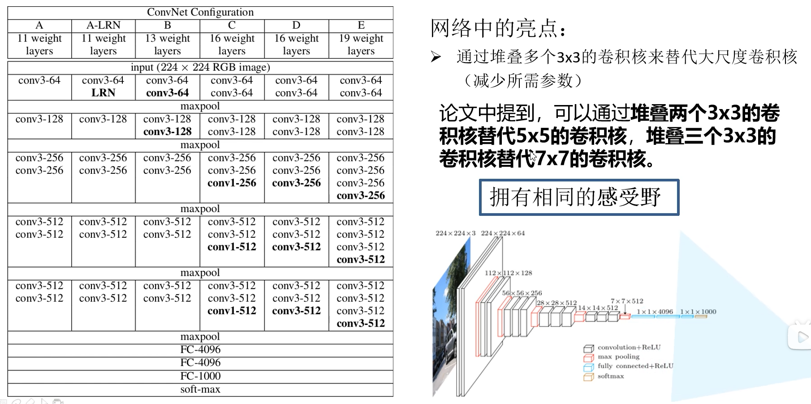
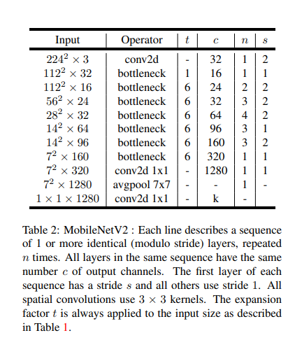

# 深度学习图像处理

## 1、反向传播

### 误差的计算

Corss Entopy Loss交叉熵

- 多分类问题，通常采用softmax输出，输出概率和为1
- 二分类问题，sigmoid输出，每个输出节点相互独立，互不相干

### 误差的反向传播

### 权重的更新

新权重=老权重-学习率*损失梯度方向

对于整个样本集，损失梯度方向与全局最优方向一致

使用分批次(batch)，损失梯度方向指向当前批次最优方向(局部最优)

### 优化器optimizer

- SGD

  w~t+1~=w~t~-α·g(w~t~)，α是学习率，g(w~t~)为t时刻对参数w~t~的损失梯度

  容易受样本噪声的影响，可能陷入局部最优解

- Momentum

  v~t~=η·v~t-1~+α·g(w~t~)，η是动量系数

  w~t+1~=w~t~-v~t~

- Adagrad(自适应学习率)

  

  

## 2、pytorch demo

### pytorch安装

### 简单测试，LeNet

LeNet结构：


使用灰度图像。

注：pytorch通道排列顺序[batch,channel,height,width]

### demo

- 导入包

  ```python
  import torch.nn as nn
  import  torch.functional as F
  ```

- 搭建模型：

  实现方法：

  - 初始化函数，搭建网络层结构（卷积层，池化层，全连接层

    经过卷积后的矩阵尺寸计算大小公式为：
    $$
    N = (W-F+2P)/S+1
    \\输入图片大小为W*W
    \\Filter大小为F*F
    \\步长S
    \\padding的像素数P
    $$
    池化层改变的是高度和宽度，深度不变

    全连接层输入为1D，需要将特征矩阵展平

  - 定义正向传播过程（层+激活函数

    输入和输出维度的计算
    
    ```python
    #定义神经网络模型
    class LeNet(nn.Model):
        def __init__(self):
            #参数：通道数（输入图像的通道数），输出通道数(这个与卷积核有关，一个卷积核对应一个输出通道)，卷积核大小
            #每个卷积核与每个图片的每个通道进行运算，16个卷积核得到16个通道，一共三张图片
            self.conv1 = nn.Conv2d(3,16,5)
            #第二层是一个池化层，参数为池化核大小，步长
            self.pool1 = nn.MaxPool2d(2,2)
            #卷积层
            self.conv2 = nn.Conv2d(16,32,5)
            #池化层
            self.pool2 = nn.MaxPool2d(2,2)
            #全连接层,输入特征大小，输出特征大小
            self.fc1 = nn.Linear(32 * 5 * 5 , 120)
            self.fc2 = nn.Linear(120 , 84)
            self.fc3 = nn.Linear(84 , 10)
    
        #定义前序传播的过程
        def forward(self, x):
            #N = (W - F + 2P)/S + 1
            x = self.conv1(x)       #input:(3,32,32)  output:(16,28,28)
            x = F.relu(x)
            #池化核大小为2*2，高度宽度减半
            x = self.pool1(x)       #input(16,28,28)  output:(16,14,14)
            x = self.conv2(x)       #input(16,14,14)  output:(32,10,10)
            x = F.relu(x)
            x = self.pool2(x)       #input(32,10,10)  output:(32,5,5)
            x = self.fc1(x)         #input:32 * 5 * 5 , 此时要求output 120
            x = F.relu(x)
            x = self.fc2(x)         #input:120 , 此时要求output是84
            x = F.relu(x)
            x = self.fc3(x)         #input:84 , 此时要求一共10个类，最后得到10个类
            return x
    ```

- 数据集的使用

  数据集：CIFAR10，For this tutorial, we will use the CIFAR10 dataset. It has the classes: ‘airplane’, ‘automobile’, ‘bird’, ‘cat’, ‘deer’, ‘dog’, ‘frog’, ‘horse’, ‘ship’, ‘truck’. The images in CIFAR-10 are of size 3x32x32, i.e. 3-channel color images of 32x32 pixels in size.

  

- 数据集的处理

  1. 数据集下载

  2. 数据图片预处理（测试集，训练集

  3. 数据集导入，分batch

  4. 使用pytorch给的例程进行图像显示

     ```python
     #设置处理图片的方式
     transform = transforms.Compose(
             [transforms.ToTensor(),
              transforms.Normalize((0.5, 0.5, 0.5), (0.5, 0.5, 0.5))])
     
     batch_size = 32
     
     trainset = torchvision.datasets.CIFAR10(root = './dataset/CIFAR' , train=True , download= False, transform=transform)
     #shuffle——是否打乱，num_works——载入数据的线程数目，windows设置为0
     trainloader = torch.utils.data.DataLoader(trainset, batch_size=batch_size,
                                               shuffle=True, num_workers=0)
     testset = torchvision.datasets.CIFAR10(root = './dataset/CIFAR' , train=False , download= False , transform=transform)
     #shuffle——是否打乱，num_works——载入数据的线程数目，windows设置为0，batch_size因为是测试集，所以一次加载所有图像
     testloader = torch.utils.data.DataLoader(testset, batch_size=10000,
                                               shuffle=False, num_workers=0)
     
     
     
     #图片类别，一共10个类别
     classes = ('plane' , 'car' , 'bird' , 'cat' , 'deer' , 'dog' , 'frog' , 'horse'
                ,'ship' , 'truck')
     
     #转化为迭代器
     test_data_iter = iter(testloader)
     test_image , test_label = next(test_data_iter)
     
     
     #查看数据
     def imshow(img):
         img = img / 2 + 0.5     # unnormalize
         npimg = img.numpy()
         plt.imshow(np.transpose(npimg, (1, 2, 0)))
         plt.show()
     
     
     # get some random training images
     dataiter = iter(trainloader)
     images, labels = next(dataiter)
     
     # show images
     imshow(torchvision.utils.make_grid(images))
     # print labels
     print(' '.join(f'{classes[labels[j]]:5s}' for j in range(batch_size)))
     ```

     

- 训练

  1. 导入模型，之前设置的网络结构

  2. 定义损失函数

  3. 定义优化器

  4. 训练/测试过程：

  5. 模型保存：

  6. 使用模型进行预测：

     ```python
     #神经网络的训练
     ##实例化模型
     le_net = LeNet()
     
     ##定义损失函数和优化器
     loss_func = nn.CrossEntropyLoss()#使用交叉熵
     optimizer = optim.Adam(le_net.parameters() , lr = 0.0001 )
     
     ##训练网络
     for epoch in range(10):
         running_loss = 0.0#运行是损失
         for step , data in enumerate(trainloader , start=0):
             # get the inputs; data is a list of [inputs, labels]
             inputs , labels = data
     
             #zero the params gradients
             optimizer.zero_grad()
     
             #forward
             outputs = le_net(inputs)
             #backforward : 计算梯度
             loss = loss_func(outputs , labels)
             loss.backward()
             optimizer.step()
     
             #print statistics
             running_loss += loss.item()
             if step % 100 == 0:
                 with torch.no_grad():
                     outputs = le_net(test_image)
                     predict_y = torch.max(outputs , dim=1)[1]
                     acc = torch.eq(predict_y , test_label).sum().item() / test_label.size(0)
                     print('[%d, %5d] train_loss: %.3f  test_accuracy: %.3f' %
                           (epoch + 1, step + 1, running_loss / 500, acc))
                     running_loss = 0.0
     print('Finished Training')
     
     save_path = './Lenet.pth'
     torch.save(le_net.state_dict(), save_path)
     
     
     from PIL import  Image
     #预测图片
     ##首先加载模型
     net = LeNet()
     net.load_state_dict(torch.load('Lenet.pth'))
     ##加载图片并进行处理
     trans = transforms.Compose(
         [transforms.Resize((32 , 32)),
          transforms.ToTensor(),
          transforms.Compose((0.5,0.5,0.5) , (0.5,0.5,0.5))
          ]
     )
     im = Image.open("test.jpeg")
     im = trans(im) #[C H W]
     im = torch.unsqueeze(im , dim =0)#[N C H W]
     with torch.no_grad():
         outputs = net(im)
         pre = torch.max(outputs , dim = 1)[1].numpy()
     print(classes[int(pre)])
     ```
     


## 3、AlexNet

### AlexNet介绍

[论文地址](https://proceedings.neurips.cc/paper/2012/file/c399862d3b9d6b76c8436e924a68c45b-Paper.pdf)

[重读论文](https://www.bilibili.com/video/BV1hq4y157t1/?spm_id_from=333.337.search-card.all.click&vd_source=d6ce039dfc8b2b0222630cdf841a3ca9)


- 首次利用GPU进行网络加速 
- 使用ReLU激活函数，而不是传统的Sigmoid以及tanh函数
- 使用LRN局部响应归一化
- 在全连接层的前两次使用了dropout随机失活神经元操作，减少过拟合

**Conv1：**

kernel : 48 * 2

kernel_size = 11

padding : [1,2] , 特征矩阵左边和上边加上一列和一行0，右边和下边加上2列和两行0

stride : 4

input_size = [224 , 224 , 3]

output_size = [55 , 55 ,48 * 2]
$$
N=(W-F+2P)/S+1
=[224 - 11 + (1+2)]/4 + 1
$$
**Maxpool1：**

kernel_size = 3

padding : 0  

stride : 2

input_size = [55 , 55 , 96]

output_size = [27 , 27 ,96]

**Conv2:**

kernels : 128 * 2

kernel_size : 5

padding : [2,2]

stride : 1

output_size = [27,27,128 * 2]

**Maxpool2:**

kernel_size = 3

padding = 0

stride = 2

output_size = [13 , 13 , 256]

**Conv3:**

kernels=384

kernel_size=3

padding=[1,1]

stride=1

output_size=[13,13,384]

**Conv4:**

kernels=384

kernel_size=3

padding=[1,1]

stride=1

output_size=[13,13,384]

**Conv5:**

kernels=256

kernel_size=3

padding=[1,1]

stride=1

output_size=[13,13,256]

**Maxpool3:**

kernel_size=3

padding=0

stride=2

output=[6,6,256]

### 数据集介绍

[数据集](https://github.com/WZMIAOMIAO/deep-learning-for-image-processing/tree/master/data_set)

一共5个类别(花)，使用脚本软件先对数据集进行划分，得到测试集和验证集

### Pytorch搭建AlexNet

- 模型定义和构建

  1. 定义网络结构（卷积层+全连接层
  2. 定义传播过程（输入+卷积层处理+展平+全连接层+输出
  3. 初始化参数（权重）判断

- 训练和验证

  指定训练硬件

  训练数据集处理：随机裁剪，随机翻转，**转为张量**，标准化/正则化

  开始训练

  验证模型

- 利用模型进行预测

### 使用AlexNet训练自己的数据集


## 4、VGG（visual geometry group

[论文](https://arxiv.org/pdf/1409.1556.pdf)

[参考资料1，李沫老师](https://www.bilibili.com/video/BV1Ao4y117Pd/?spm_id_from=333.999.0.0&vd_source=d6ce039dfc8b2b0222630cdf841a3ca9)

[参考资料2，up讲解](https://www.bilibili.com/video/BV1q7411T7Y6/?spm_id_from=333.788&vd_source=d6ce039dfc8b2b0222630cdf841a3ca9)

[参考资料3，文字版](https://www.bilibili.com/read/cv15300443/)

### VGG介绍

VGG的提出是2014年，可以应用在分类任务和定位任务。对比AlexNet，VGG的深度更深，但实质上仍然是卷积层+全连接层。

**对比LeNet，AlexNet更深、更大。**因此我们思考，如果比AlexNet更深，更大，那么学习精度能否更好？如何更深，更大：

- 更多的fc层（太贵，占内存，计算量巨大）
- 更多的卷积层（AlexNet先将LeNet的模型扩大，加上三个卷积层，不好实现对模型的进一步的加大、加深；VGG的思想先是将卷积层组成小块，然后再将卷积层进行堆叠）
- 将卷积层组合成块（VGG提出了VGG块的概念，实质上是对AlexNet思路的拓展：**AlexNet中包含三个一样的卷积层（3 * 3， 384通道，padding=1），加上一共池化层（3 * 3， 最大池化层， stride=2）组成了一共小块；VGG的拓展则是，它不限制块中卷积层的层数和通道数**，最大池化层重新用回了LeNet中的**最大池化层窗口（2 * 2 ， 最大池化层 ， stride = 2）**）

#### VGG块


VGG的核心思想时**使用大量有一定数目的3 * 3的卷积层和一共最大池化层组成的VGG块进行堆叠**，最后得到稳定的网络。

- 为什么使用的卷积层是3 * 3，而不是5 * 5？5 * 5的卷积层也用过，但是5 * 5的卷积层的计算量更大，所以层数就不会太大，VGG块就会变得浅一点，最终通过对比发现，在同样的计算开销之下，大量的3 * 3的卷积层堆叠起来比少量的5 * 5的卷积层堆叠起来的效果更好，也就是说**模型更深、卷积窗口更小的情况下，效果会更好一点**
- VGG块由两部分组成：多个填充为1的3 * 3卷积层（它有两个超参数：层数n、通道数m）和一个步幅为2的3 * 3最大池化层 

卷积神经网络的组成部分：

- 带填充的卷积层（使用填充，保持分辨率）
- 非线性激活函数（ReLu）
- 池化层（如最大池化层）

VGG构成：

- 3 * 3 的卷积核，填充为1（保持宽度和高度）的卷积层
- 2 * 2 的池化核，步长为2（每个块后的分辨率减半）的最大池化层

#### 感受野



感受野：在卷积神经网络中，决定某一次输出结果中，一共元素所对应的输入层的区域大小，称之为感受野。（输出feature map上的一个单元对应输入层上的区域大小）


**推算是从后向前推算**


例子：如何用3 * 3卷积核替换7 * 7卷积核

已知：卷积核大小3 * 3 ， 步长stride = 1(默认)

1. Feature map的感受野F = 1
2. Conv3 * 3(c) ： F = (1 - 1) * 1 + 3 = 3
3. Conv3 * 3(b) : F = (3 - 1) * 1 + 3 = 5
4. Conv3 * 3(a) : F = (5 - 1 ) * 1 + 3 =7

**有该例子可以知道，采用三个3 * 3的卷积核获得的感受野大小，与采用一个7 * 7的卷积核获得的感受野相同**

7 * 7 卷积核需要参数： 7 * 7 * C * C =49C^2^(第一个C，通道数，第二个C，卷积核个数)

3个3 * 3所需参数 ： 3 * 3 * 3 * C * C = 27C^2^

**参数减少**

#### VGG架构


- 将AlexNet中的卷积部分替换成多个VGG块
- 不同次数的重复块得到不同的架构，例如VGG-16,VGG-19
- 最后还是使用4096的全连接层得到输出
- VGG对比Alex：将AlexNet在LeNet的基础上新加的卷积层抽象出了VGG块，替换掉了AlexNet中原先并不规则的部分 
- VGG构成：第一部分是**卷积层+池化层**，第二部分**全连接层**

思想：**使用重复的卷积快来构建深度卷积神经网络**，**不同卷积块的个数和超参数可以得到不同复杂度的变种**


原始VGG网络：5个块，前2个块各有一共卷积层，后三个块包含两个卷积层；第一个块，有64个输出通道，后续模块将输出通道的数量翻倍，直到512，由于该网络使用了8个卷积层和3个全连接层，因此被称为VGG-11（为什么是5块？原始输入图像大小是224，没经过一个VGG块，通道翻倍，高度跨度会减半，当第五次的时候，世出的高和宽为7，不能再减半了

#### VGG16网络分析


#### 总结

- VGG使用可重复使用的卷积块来构建深度卷积神经网络（将ALexNet中不规则的部分抽象出来做成了VGG块，它是一种可复用的卷积块）
- 通过配置不同的卷积块个数和通道数可以得到不同复杂度的变种（不同的VGG模型可以通过每个块中卷积层数量和输出通道数量的差异来定义）
- 这个思想在之后被大量使用：1、使用可重复的块来构建深度神经网络；2、网络产生不同的配置
- 块的使用导致网络定义的非常简洁。使用块可以有效地设计复杂的网络。
- 深层且窄的卷积（3×3）比浅层且宽的卷积更有效 

## 5、GoogleNet（going deeper with conbolutions

### GoogleNet介绍

- 引入了Inception结构（融合不同尺度的特征信息
- 使用1×1的卷积核进行降维以及映射处理
- 添加两个辅助分类器帮助训练（在AlexNet和VGG中只有一个输出层，但是GoogleNet有三个输出层（两个辅助输出层）
- 丢弃fc层，使用平均池化层（大大减少模型参数 

### GoogleNet网络结构：

#### Inception结构


- 初始版本（左边

  Inception是并行结构，将上层的输出作为输入，输入用三个卷积(1 * 1 , 3 * 3 , 5 * 5)和一个3 * 3最大池化结构进行处理。将这四部分输出结果（特征矩阵）沿深度方向拼接，得到一个输出

  **注：**每个分支得到的特征矩阵的高度和宽度必须相等

- 降维结构（右边

  可以看到多了三个1 * 1的卷积核（三个黄颜色方块），这三个卷积核可以起到降维的作用：

  

  如上图，1 * 1的卷积核减少特征矩阵深度，从而减少参数，提高运算速度
  
  基于保持神经网络结构的稀疏性，又能充分利用密集矩阵的高计算性能的出发点

#### 辅助分类器（Auxiliary Classifier


- 第一层：平均池化下采样操作，大小5 * 5，步长为3。对于4a产生4×4×512的输出，4b生成4×4×528
  $$
  out_{size} =(in_{size} - Filter_{size}+2P)/S+1
  $$

- 第二层：128个卷积核，大小1×1，进行降维处理，使用ReLU激活函数

- 第三层：节点数为1024的全连接层，激活函数仍然为ReLU

- 第三层~第四层：dropout，比例为70%，随机将节点的输出置零

- 第四层：输出层，全连接层，最后通过softmax得到概率分布

  辅助分类器相当于对模型做了融合，同时给网络增加了反向传播的梯度信号，在一定程度上提供了正则化的作用。

#### 全局网络结构和参数：


### 搭建GoogleNet网络

卷积+最大池化+inception结构+辅助分类器（重复结构多

#### 模板文件

- 卷积模板
- inception模板
- 辅助分类器

#### GoogleNet网络

## 6、ResNet

### ResNet介绍

- 超深的网络结构
- 提出残差模块residual
- 使用Batch Normalization加速训练（丢弃了dropout

**简单的通过卷积层进行堆叠，效果会变差，原因？**

- 梯度消失或者梯度爆炸

  梯度每向前传播一层，都要乘以一个小于1的误差梯度

  原梯度即为G，n层之后梯度为
  $$
  G_n = G * x_1 * ... * x_{n-1} 
  $$
  G~n~最后趋近于0，梯度消失

  反之，如果每向前传播一层，都会乘以一个大于1的数，那么最后梯度G~n~会非常大，梯度爆炸

- 退化问题

  当梯度消失或者梯度爆炸，层数深的效果仍可能没有层数浅的效果好

#### 残差结构


- 左边

  网络结构较浅

  主线：输入经过两个3×3的卷积核得到结果

  支线：又称为shortcut，与主线结果直接相加，在经过ReLU变换得到最终结果（shortcut与主线的输出特征矩阵shape必须相同

- 右边

  网络结构较深，这样可以有效节约参数


- 实线

  卷积核步长=1

  分支没有卷积核

- 虚线

  卷积核步长=2

  分支有一个1×1的卷积核，步长=2

  对输入特征矩阵的H，W，C三个参数都进行变换

#### 残差网络参数


上为18，34，50，101，152层的残差网络参数 

#### BN层

**使一批Batch的feature map满足均值=0，方差=1的分布规律**

[BatchNormalization详解](https://blog.csdn.net/qq_37541097/article/details/104434557)


- 均值和方差在正向传播过程中，统计得到
- γ和β在反向传播过程中计算得到

### 迁移学习


- 快速得到理想的结果
- 数据集较小的时候也能够训练出理想的结果

**使用预训练模型，快速得到收敛结果**


一些学习好的浅层网络的参数：例如角点，边...在别的网络中仍然适用。因此可以把这些参数用于新的网络，新的网络底层学习可以直接使用这些已经学习好的参数，网络学习效率也能有效提升。

#### 迁移学习的方式

1. 载入权重后训练所有的参数
2. 载入权重后只训练最后几层参数
3. 载入权重后在网络基础上再添加一层全连接层，仅训练最后一个全连接层

**根据硬件参数和训练时间来选择**

## 7、MobileNet

传统卷积神经网络，内存需求大、运算量大，因此在移动设备和嵌入式设备上运行困难

例如，VGG16，参数权重大小约150MB；ResNet152层约644MB。这么大的模型无法运用到嵌入式设备上。

### MobileNetV1

google于2017年提出的，用于移动端或者嵌入式设备中的轻量级CNN网络。对比传统的神经网络，准确率小幅度降低，但是模型参数与运算量大大减少。（VGG16准确率减少了0.9%，但是模型参数是VGG的1/32）

- Depthwise Convolution（DW卷积，大大减少模型运算量和参数数量
- 超参数α（控制卷积层/核个数），β（控制输入图像大小），这两个参数人为设置

#### DW 和 传统卷积


1. 传统卷积：

   输入特征矩阵channel=卷积核channel

   输出特征矩阵channel=卷积核个数

2. DW卷积：

   卷积核channel=1

   输入特征矩阵channel=卷积核个数=输出特征矩阵channel

   **没有传统卷积的运算结果的特征融合**，通过DW，特征矩阵深度不变

3. PW卷积

   Pointwise Conv，卷积核大小为1的普通卷积，所以也有：

   输入特征矩阵channel=卷积核channel

   输出特征矩阵channel=卷积核个数

PW+DW共同使用


D~F~输入特征矩阵的高和宽，D~k~卷积核的大小，M输入特征矩阵的深度，N输出特征矩阵的深度

（卷积核高度 * 卷积核宽度 *卷积核通道个数） * 卷积核个数 * （输入特征矩阵高 * 输入特征矩阵宽）——步长=1时计算量公式

传统卷积：D~F~ × D~F~ × D~k~ × D~k~ × M × N

DW+PW：D~F~ × D~F~ × M × D~k~ × D~k~ + M × N × D~F~ × D~F~

理论上，普通卷积计算量是DW+PW的8到9倍

**在实际训练过程中，DW卷积核大部分会浪费掉，即卷积核大部分参数=0**

### MobileNetV2

18年提出，现对于V1，准确率更高，模型更小

- Inverted Residuals(倒残差结构)
- Linear Bottlenecks

#### Inverted Residuals


- 传统残差：降维——卷积（激活函数ReLU）——升维
- 倒残差：升维——DW（激活函数ReLU6）——降维（使用线性激活函数

$$
ReLU6:y=min(max(x,0) , 6)
$$

0以下，均为0；6以上均为6；0~6为x

**为什么要有ReLU6?**

**最后升维为什么要用线性激活函数？**


**倒残差结构**


V2中，把那个不是每一个残差结构都有shortcut，如方框所示


### MobileV3

- 更新Block（bneck)
- 使用NAS参数
- 重新设计耗时层结构

V3对比V2性能提升3.2%，延迟降低20%

#### 更新Block

- 加入SE模块，注意力机制

  

  

- 更新了激活函数

  
  
  

#### 重新更新耗时层结构

1. 减少第一个卷积层的卷积核个数（32->16，准确率不变

2. 精简Last Stage

   

   original last stage -> efficient last stage，层结构减少，准确率不变，节省了7ms的执行时间（占整个推理过程的11%

#### 重新设计激活函数

$$
swish\space x =x · σ(x)
$$

但是swish计算，求导复杂；对量化过程非常不友好
$$
h-swish[x]=x\frac{ReLU6(X+3)}{6}
$$
h-swish曲线非常贴近swish，推理速度变化，对量化过程友好

### 实践一：搭建MobileV2结构



n表示结构重复次数，t是拓展因子，c是输出特征矩阵的深度channel，s是步长（针对第一层，其他为1


倒残差结构，第一层是一个普通的卷积，大小为1×1；第二层，DW卷积，大小为3×3；第三层，1×1卷积层，使用线性激活函数。

**训练时间怎么测量和计算，MobileNet怎么放到ROS中进行运算？**

## 8、ShufflenNet

### ShuffleNet v1


Shuffle0.5~2对比AlexNet和MobileNetV1，时间消耗的正确率分析。（在骁龙820处理器上运行，单线程）

**在group卷积之后加上Channle Shuffle模块**

#### Channel Shuffle

现在的神经网络大多是包含重复的块的。最先进的例如Xception以及ResNeXt介绍了深度可分离卷积depthwise separable convolutions以及group cpnvolutions，他们可以平衡表示和计算之间的开销。**但是这两种网络都没有充分考虑1×1卷积（pointwise convolutions），因为其具有一定的复杂性。**例如，在ResNeXt中，只使用了3×3的卷积核在group convolution中。对于每个禅茶单元，pointwise conv占用了93.4%乘法和加法。（代价很高）

解决这个问题就是使用**channel sparse connections**，例如group convolutions，即1×1的卷积。通过保证每个卷积操作仅仅是在相应的输入通道组input channel group进行操作，group conv的计算开销大大减少。**但是，如果多个group conv堆叠在一起，来源于一个特定卷积的输入仅仅只源于输入通道的一小部分**。如图所示：


图为Channel Shuffle通过两个group conv(GConv)堆叠而成。

使用组卷机获得来源于不同组的input data，并且输入和输出通道将会是完全关联。特别的，如图（c）我们可以将通道划分为子组，然后下一层通过选取划分的子组进行整合后输入。**这就是Channel Shuffle操作。**

#### Shuffle Unit

由上面的channel shuffle操作，我们提出了ShuffleNet Unit。如下图所示：


(a)是残差模块，应用在3×3的卷积层中，我们使用一个计算经济的3×3深度卷积在bottleneck feature map中。之后，我们把第一个1×1卷积层用带有channel shuffle的逐点卷积pointwise group convolution来替代，这样**3×3与channel shuffle就构成了一个Shuffle Unit**，如(b)所示。第二个pointwise group convolution的目的是**恢复输出通道维度能够匹配shortcut的维度。**在其中的BN层操作与非线性操作与论文[9,40] (ResNet和ResNeXt)一样，但是我们在深度卷积之后不使用ReLU激活函数。在(c)中，我们对shufflenet unit添加了两个修改：1、在shortcut中加入3×3的平均池化；2、用channel conv取代element-wise结构，这能够更容易计算以减少计算开销。

对于c×h×w的输入和bottleneck channels为m的网络
$$
ResNet:\space hw(2cm+9m^2)FLOPS
\\ResNeXt:\space hw(2cm+9m^2/g)FLOPS
\\ShuffleNet:\space hw(2cm/g+9m)FLOPS
\\g代表GConv的数量
$$

注：FLOPS，全大写，指每秒浮点运算次数，一个硬件计算速度的性能指标；FLOPs，小写，浮点运算数，理解为计算量，可以用来表示算法/模型的复杂度。

#### Architecture


### ShuffleNetV2

计算复杂的不能只看FLOPs，因此提出了四条设计高效的网络准则，提出新的block设计。

其他需要考量的因素例如memory access cost(MAC)，内存访问时间成本，在模型推理过程中占很大的时间比例；degree of parallelism，并行等级，并行度高的运行速度更快；不同的平台上执行时间也不一样。


由上图可见，Conv操作占据了很大一部分的时间，但是其他操作也会占据一定时间。因此，单单从FLOPS不能获得模型性能效率。因此，**作者给出了四条准则用来搭建网络：**

- G1：Equal channel width minimizes memory access cost(MAC)——当卷积层的输入特征矩阵与输出特征矩阵channel相等时，MAC要最小（保持FLOPs不变时），针对1×1卷积

  

  c~1~与c~2~分别是输入特征矩阵和输出特征矩阵。

- G2：Excessive group convolution increases MAC——当GConv的groups增大时(在保持FLOPs不变时)MAC也会增大

  

  注意，对于group conv要除以g，MAC随着g增大而增大

- G3：Network fragmentation reduces degree of parallelism——网络设计的碎片化程度越高，速度越慢

  

  碎片化结构能够提供准确率，但是会降低模型效率。因为在运算过程中，如图d，最终的结果需要得到最慢的模块运算完成之后才能够得到。

- G4：Element-wise operations are non-negligible

  

  例如激活函数ReLU,shortcut与主分支相加等操作，这些都是Element-wise操作。这些操作的特点是单个操作不耗时，但是在神经网络运算过程中这些操作的MAC很大。

总结：基于这四条原则，作者认为一个有效的神经网络应该使用“balanced”平衡的卷积(**输入通道：输出通道≈1**)；慎重使用GConv，虽然增加GConv能够提高精度，降低计算参数，但是计算成本时间会增加；减少网络碎片程度；减少不必要的element-wise的设计。

#### ShuffleNet V2设计


**图(c)(stride=1)：**

- 对于c个特征通道输入，我们将其分为两个通道，第一个通道的通道数是c-c'，第二个通道的通道数是c'。根据G3，我们要减少模型碎片化程度，左边没有任何操作；右边使输入特征矩阵通道：输出特征矩阵通道≈1。（c'=c/2
- 1×1卷积不再使用GConv，满足G2尽可能降低groups的数值。
- 最后两个branches进行concatenated连接拼接（区别于Add操作，Add操作需要保持高和宽相同；concatenated操作是对split操作进行还原，保持channel一致），因此，通道数保持不变。例如ReLU,depthwise conv等操作仅仅在一个分支中出现，对应G4。同时，对于conv split ，concat以及Channel Shuffle，这三个部分可以合并成一个Element-wise，这也减少了Element-wise操作个数。

**图(d)(stride=2)：**

- 没有channel split操作，因此输出特征矩阵的操作翻倍（因为输入和输出保持一致，所以左和右分支的output相等，在经过concat操作翻倍）

### ShuffleNetV2 Architecture


#### ShuffleNet V2搭建

- channel shuffle操作

  ```python
  x = x.view(batch_size , groups , channels_per_group , height , width)#将线性的channels结构进行划分，得到三个组
  x.transpose(x,1,2)#得到的组的参数维度1,2进行调换，即按组分变成按通道分
  ```

  

- blocks构造

  首先需要判断步长的情况，因为在shuffleNetV2中，stride=1或stride=2会有不同处理

  将通道划分为c和c'，作为不同分支的输入

## 9、EfficientNet

回顾之前的网络，对于AlexNet,VGG,ResNet这些网络，在处理图像过程中，我们都有一个统一操作：**将图像大小设置为224。**为什么要设置这个值，为什么网络深度要这么深？当然，这是实验得到的经验。

这篇论文主要使用NAS（Neural Architecture Search）技术来搜索网络的图像输入分辨率r，网络深度depth以及channel的宽度width三个参数的合理化配置。**之前的论文都是改变三个参数中的一个来提升网络性能，本文同时来探索这三个参数的影响。**下图是EfficientNet与其他网络之间的对比：


### 论文思想

在之前的论文中，通过增加网络的width即卷积核个数（特征矩阵的通道数）来提升网络性能，如下图(b)，通过增加网络深度使用更多的层结构来提升网络性能，如下图(c)，通过增加输入分辨率来提升网络性能如图(d)。图(e)展示了如何同时增加网络的width、网络的深度以及输入网络的分辨率来提升网络性能：


- 根据经验，增加网络深度depth能够得到更为丰富、复杂的特征并且能够很好的应用到其他任务中。但会出现**梯度消失/爆炸**的问题。
- 增加网络的宽度能够获得更高的细粒度，同时也更容易训练，但是对于width很大而深度较浅的网络难以学习到深层次的特征。
- 增加输入网络的图像分辨率能够潜在获得更高细粒度的特征模板，但是对于非常高的分辨率，准确率的收益也会减少。并且大分辨率会增加计算量。

下图展示了EfficientNetB-0分别增加width,depth,resolution后得到的统计结果，大概准确率在80%就不能再继续上升了：


之后作者又做了一个实验，采用不同的depth和resolution(这里即为d,r)，之后不断改变网络的width就得到了下图所示的四条曲线，通过取相同的FLOPs，同时增加d和r的效果最好。


**准备工作：**论文通过NAS（neural Architecture Search）技术搜索得到了EiificientNetB0结构，如下图，网络有一系列的stage组成，F'~i~表示对应stage的运算操作符，L‘~i~表示在该stage中重复F’~i~的次数。


整个网络运算的抽象：
$$
N(d,w,r)\space =\space \bigodot\limits_{i=1,...,s}F^{L_i}_i(X_{<H_i,W_i,C_i>})
\\bigodot表示连乘
\\F_i表示一个运算操作(如图中的Operator),F^{L_i}_i表示在Stage中F_i的运算重复执行L_i次
\\X表示输入Stage的特征矩阵(input tensor)
\\<H_i,W_i,C_i>表示高度，宽度以及Channels
$$
为了探究d,r,w这是哪个因子对最终准确率的影响，我们将d,r,w带入到公式中，因此我们可以得到抽象化后的优化问题：
$$
\max\limits_{d,w,r}\space Accuracy(N(d,w,r))
\\s.t.\space N(d,w,r)=\bigodot\limits_{i=1,...,s} \hat{F}^{d·\hat{L_i}}_i(X_{<r·\hat{H}_i,r·\hat{W}_i.w·\hat{C}_i>})
\\Memory(N)≤target_memory
\\FLOPs(N)≤target_flops(2)
$$

- d用来缩放$$\hat{L}_i$$
- r用来缩放分辨率，即影响$$\hat{H}_i$$和$$\hat{W}_i$$
- w就是用来缩放特征矩阵的channel，即$$\hat{C}_i$$
- target_memory为memory限制
- target_flops为FLOPs限制

接着作者又提出了一个混合缩放方法 ( compound scaling method) 在这个方法中使用了一个混合因子$$ϕ$$去统一的缩放width，depth，resolution参数，具体的计算公式如下，其中s. t . 代表限制条件：
$$
depth:d=α^Φ\\
width:w=β^Φ\\
resolution:r=γ^Φ(3)\\
s.t.\space α·β^2·γ^2≈2
\\α≥1,β≥1,γ≥1
$$

- FLOPs(理论计算量)与depth的关系是：当depth翻倍，FLOPs也翻倍
- FLOPs与width的关系是：当width翻倍（通道数channel翻倍），FLOPs会翻4倍，因为卷积层的FLOPs约等于$$feature_w×feature_h×feature_c×kernel_w×kernel_{number}$$（这里我们假设输入和输出的矩阵高度和宽度不变），当width翻倍输入特征矩阵的channels(feature~c~)和输出特征矩阵的channels和卷积核的个数(kernel~number~)都会反被，所以FLOPs会翻4倍
- FLOPs与resolution的关系是：当resolution翻倍，FLOPs也会翻4倍，和上面类似因为特征矩阵的宽度frature~w~和特征矩阵的高度feature~h~都会翻倍

因此总的FLOPs倍率可以近似用(α·β^2^·γ^2^)来表示，当该值≈2时，对于任意一个φ而言FLOPs相当于增加了2^φ^倍

之后，作者就在基准网络EfficientNetB-0上使用NAS来搜索α,β和γ三个参数：

- 首先固定φ=1，基于上面(2)和(3)进行探索，实验发现最佳参数(α,β,γ)=(1.2,1.1,1.15)
- 之后固定(α,β,γ)=(1.2,1.1,1.15)，使用不同的φ求解EfficientNetB-1至EfficientNetB-7

### 网络详细结构：


上表为EfficientNet-B0网络框架(之后的B1-B7都是在此基础上修改resolution,channels以及layers)。网络总共分成了9个stage：

- 第一个Stage是3×3，stride=2的不同卷积（包含BN层以及激活函数Swish
- Stage2~Stage8都是重复MBConv结构（最后一列的Layers表示MBConv重复的次数）。表格中每一个MBConv后边会有一个数字（1或者6），这就代表倍率因子，表示第一个1×1卷积层将会将输入矩阵的channels扩充为n倍，k3×3或者k5×5表示采用MBConv中Depthwise的卷积核大小。channel表示输出通道数
- Stage9由一个普通的1×1卷积（包含BN层和激活函数Swish）+池化层+FC层
- stride1~8=(2,1,2,2,2,1,2,1)，最后一层卷积层不进行卷积计算，池化后直接输出到FC。对于重复的stage，只有第一个步长是上面给定的参数

#### 什么是MBConv?

MBConv就是MobileNetV网络中的InvertedResidualBlock，但有一些区别：

- 采用的激活函数不一样，MBConv中采用的是Swish激活函数
- 每一个MBConv中加入了SE（Squeeze-and-Extraction）模块


在MBConv中，有一个1×1的卷积（升维，包含BN和Swish）。一个k×k的Depthwise Conv卷积（包含BN和Swish）k的具体指就是见表。一个SE模块，一个1×1的普通卷积（降维，包含BN），一个Dropout结构。

- 第一个1×1的升维卷积层，卷积核个数是输入特征矩阵channel的n倍，根据表中的倍率因子决定n
- 当n=1是，不要第一个升维的1×1卷积层，即stage2中的MBConv结构都没有第一个升维的1×1的卷积层
- 关于shortcut，当输入特征矩阵和输出特征矩阵shape相同时才存在，并且步长为1
- SE模块如下图所示，有一个全局平均池化，两个全连接层组成。第一个全连接层的节点是输入该MBConv特征矩阵channels的$$\frac{1}{4}$$，激活函数为Swish。第二个全连接层的节点个数=Depthwise conv层输出的特征矩阵channels，激活函数为sigmoid
- Dropout层的`dropout_rate`在tensorflow的keras源码中对应的是`drop_connect_rate`后面会细讲


## 10 、Transformer中的Self-Attention


### Self-Attention


假设**输入**序列长度=2，一共两个输入节点x~1~，x~2~，然后通过**Input Embedding**即图中的f(x)将输入映射到a~1~和a~2~。紧接着分别将a~1~，a~2~通过变换矩阵W~q~,W~k~,W~v~得到对应的q^i^,k^i^,v^i^(源码中直接是使用FC层实现)

- q：query(to match others)
  $$
  q^i=a^iW^q
  $$

- k：key(to be matched)
  $$
  k^i=a^iW^k
  $$

- v：information to be extracted
  $$
  v^i=a^iW^v
  $$

Attention(Q,K,V)=softmax($$\frac{QK^T}{\sqrt{d_k}}$$)V

**用Q和K进行match**


**结果与V相乘**


总结：Self-Attention就是输入a1,a2得到b1,b2（公式如上

### Multihead-Attention

- 一个head的情况

- 2个head的情况

  

  如上图，将q^1^,k^1^,v^1^进行拆分，将拆分的数据进行分类：

  

  对于每个head执行self-attention这个操作：
  $$
  head_i=Atteton(QW_i^Q,KW^K_i,VW^V_u)
  \\MultiHead(Q,K,V)=Concat(head_1,...,head_n)W^o
  $$
  

  第一个数字相同的部分进行拼接，再将结果按顺序拼接在一起

### Positional Encoding


如果只是将结果拼接，语序会混乱，因此添加pe~i~计算得到


### VisionTansfomer


在VIT模型中，模型由三个模块构成：

- LinearProjection of Flattened Patches(Embedding层)
- Transfomer Encoder(图右侧)
- MLP Head(最终用于分类的层结构)

#### Embedding层结构详解

**对于标准的Transformer模块**，要求输入的是token(向量序列)，即二维矩阵[num_token,token_dim]，如下图，token0-9对应的都是向量，以ViT-B/16为例，每个token向量的长度为768。


**对于图像数据而言**，其数据格式为[H,W,C]这是个三维矩阵，显然Transformer处理向量无法处理该三维矩阵。**因此我们使用一个Embedding层**来对数据进行变换，如下图：


- 将一张图片按照给定大小划分成许多Patches。以ViT-B/16为例，它是将大小为(224×224)的图片按照16×16的大小进行划分，划分后有(224/16)^2^=196个Patches。
- 线性映射将每个Patch映射到一维向量中，仍以ViT-B/16为例，每个Patches数据shape为[16,16,3]通过映射得到一个长度为768的向量(token)。16 * 16 * 3 =768

**在代码实现中，我们通过一个卷积层实现**。以ViT-B/16为例，直接使用一个卷积核大小为16×16，步长为16，卷积核个数为768的卷积来实现。通过卷积[224,224,3]->[14,14,768],然后把H和W两个维度展平即可[14,14,768]->[196,768]，此时正好变成一个人二维矩阵，这正是Transformer需要的。

**在输入Transformer Encoder之前需要注意加上[class]token以及Position Embedding。**在原论文中，作者是参考了BERT，在刚刚得到的一堆tokens中插入一个专门用于分类的[class]token，它是一个可训练的参数，数据格式跟其他的token拼接在一起，例如Cat([1,768],[196,768])->[197,768]。

Position Embedding就是之前的Transformer中的Positional Encoding，这里使用一个可训练的参数，是直接叠加在tokens上的(add)，所以shape要一样。如上的例子，拼接之后的shape是[197,768]，你们这里的Position Embedding的shape也是[197,768]

#### Transformer Encoder详解

Transformer Encoder其实就是重复堆叠Encoder Block n次，如下图：


- Layer Norm，该Normalization方法主要是针对NLP领域提出的，这里对每个token进行Norm处理

  **BN就是在每个维度上统计所有样本的值，计算均值和方差；LN就是在每个样本上统计所有维度的值，计算均值和方差**

  

- MultiHead Attention

- Dropout/DropPath，在原论文的代码中是直接使用Dropout层，但之后有的实现是使用Droppath（可能会更好）

- MLP Block，如Transformer Encoder结构所示（右侧），就是全连接+GELU激活函数+Dropout组成。注意：第一个FC把输入节点个数翻4倍，第二个FC会还原节点个数。n->4n->n

#### MLP Head详解


通过Transformer Encoder后输出的shape和输入的shape是保持不变的。在Transfomer Encoder后还有一个Layer Norm结构。原论文中MLP Head是有Linear+tanh激活函数+Linear组成（ImageNet21K）。但是迁移到ImageNet1K或者自己的数据集只需要一个Linear就行。

[博主的VIT结构](https://blog.csdn.net/qq_37541097/article/details/118242600)


#### 模型参数


### 补充：Hybrid混合模型

用传统的神经网络提取特征+通过VIT得到最终结果

- 特征提取：使用ResNet50，卷积层用StdConv2d替换传统的Conv2d
- BN层用GroupNorm层替换
- Stage4中的三个Block移动至Stage3中


## ViT实践


# 目标检测Objection Detection

- one stage（SSD,YOLO

  基于anchors直接进行分类以及调整边界框

  **速度快**

- two stage（FAST-RCNN

  1. 通过专门的模块去胜出候选框(RPN)，寻找前景以及调整边界框（基于anchors
  2. 基于之前生成的候选框进一步分类并且调整边界

  **准确度高**

## Faster RCNN

RCNN->FAST RCNN->FASTER RCNN

## RCNN

利用深度学习进行目标检测。在此之前，目标检测是使用人为定义的特征进行的，但是进入了瓶颈期。RCNN于2014年提出，直接将准确率提升了30%。

### RCNN算法分为四步：

1. 一张图像生成1000~2000个候选区域（使用Selective Search算法,ss算法

   利用ss算法通过将图像分割的方法得到一些原始区域，然后使用合并策略将这些区域合并，得到一个层次化的区域结构，在这些结构中就包含着可能需要的物体。

   

2. 对于每个候选区域，使用深度网络**提取特征**

   将每个候选框缩放到227×227pixel（Reset处理），接着将候选区域输入实现训练好的AlexNet CNN网络（图像分类），获取4096维的特征得到2000×4096维矩阵（我们把最后的全连接层去掉），4096每一行对应一个候选区域的特征向量

   

   

3. 特征送入每一类的SVM分类器，判别是否属于该类

   将2000×4096维特征与20个SVM组成的全职矩阵4096×20相乘，获得2000×20维矩阵中每一列即每一类进行非极大值抑制，提出重叠建议框，得到该列即该类中得分最高的一些建议框。所得结果就是对应类别的概率

   

   **非极大值抑制：**

   - 寻找得分最高的目标
   - 计算其他目标与该目标的IOU
   - 删除所有IOU大于给定阈值的目标

   IOU：(A∩B)/(A∪B)

   

   为什么采用交并比而不是直接用MAX？考虑出现两个相似物体的情况。

4. 使用回归其精细修正候选框位置

   对NMS处理后剩余的建议框进一步筛选。接着分别用20个回归器对上述20个类别中剩余的建议框进行回归操作，最终得到每个类别修正后的得分最高的bounding box。

   

   

### RCNN框架：


### RCNN存在的问题：

- 测试速度慢，测试一张图片约53s，用SS算法提取候选框用时约2s，一张图片中候选框存在大量重叠，提取特征操作冗余

- 训练速度慢

  过程及其繁琐

- 训练所需空间大

  对于SVM和bbox回归训练，需要从每个图像中的每个目标候选框提取特征，并写入磁盘。对于特别深的网络，如VGG16,从VOC07训练集上训练5K图像提取特征需要数百G的存储空间。

## FAST RCNN

对比RCNN，Fast RCNN同样使用VGG16作为网络backbone，但是训练时间比RCNN快了9倍，测试推理时间快了213倍，准确率从62%上升到66%（PASCAL VOC）。

### Fast RCNN训练步骤

1. 将一张图像划分为1000~2000个候选区域（Selective Search方法

2. 将一张图像输入网络得到对应的**特征图**，将SS算法生成的候选框投影到特征图上获得相应的特征矩阵

   **对比RCNN：**RCNN是将每个候选区域分别送入网络得到特征向量。而Fast RCNN是直接将整幅图像送入网络得到特征图，再将SS算法在原图上生成的候选区域映射到得到的特征图上，得到特征矩阵。

3. 将每个特征矩阵通过ROI_pooling(感兴趣区域Region of Interest)层缩放到7×7大小的特征图，接着将特征图展平通过一些列全连接层得到预测结果

   

**RCNN生成特征方式：**

R-CNN一次将候选区域输入到卷积神经网络，得到特征

**Fast-RCNN生成特征：**

将整张图像送入网络，紧接着从特征图像上提取相应的候选区域。这些候选区域的特征不需要**重复的计算**。


**数据采样：**

- 正样本：候选区域中包含目标
- 负样本：候选区域中不包含目标，例如背景等

为什么要有正/负样本：如果网络中没有负样本，在候选区域中，如果不包含要检测的对象，但是网络也可能仍会认为该区域就是要检测的对象。

**ROI Pooling Layer：**


如图所示，我们得到训练样本之后，使用RoI pooling层统一设定输入大小。


通过RoI将输入图像的尺寸缩放为7×7的特征图，这样就可以忽略输入图像的尺寸。

**分类器：**


对特征向量进行展平，通过两个全连接层后，输入到两个部分：

- Softmax用于目标概率的预测

  输出N+1个类别的概率（N为检测目标的种类，1为背景）共N+1个节点

- regressor用于边界的回归预测

  输出对应N+1个类别的候选边界框回归参数(d~x~,d~y~,d~w~,d~h~)，共(N+1)×4个节点

**边界框回归器**

输出对应N+1个类别的候选边界框回归参数(d~x~,d~y~,d~w~,d~h~)，一共(N+1)×4个节点


**损失计算 Multi-task loss**
$$
L(p,u,t^u,v)=L_{cls}(p,u)+\lambda [u≥1]L_{loc}(t^u,v)
$$
p是分类器预测的softmax概率分布p=(p~0~,...,p~k~)

u对应真实类别标签

t^u^对应边界框回归器预测的对应类别u的回归参数(t~x~^u^,t~y~^u^,t~w~^u^,t~h~^u^)

v对应真实目标的边界框回归参数(v~x~,v~y~,v~w~,v~h~)

- 分类损失$$L_{cls}(p,u)=-log p_u$$

- 边界框回归损失

  $$\lambda [u≥1]L_{loc}(t^u,v)$$

  其中$$L_{loc}(t^u,v)=Σ_{i∈(x,y,w,h)}smooth_{L_1}(t^u_i-v_i)$$

  $$smooth_{L_i}(x)=\begin{cases}0.5x^2\space if|x|＜1\\|x|-0.5\space otherwise\end{cases}$$

  [smooth损失参考资料](https://www.cnblogs.com/wangguchangqing/p/12021638.html)

  $$\lambda [u≥1]$$：λ是平衡系数，[u≥1]是艾弗森括号（满足条件对应正样本，不满足为副背景

**总结：**


**SS算法是Fast RCNN的速度瓶颈**

## FASTER RCNN

同样使用VGG16作为网络的backbone，推理速度在GPU上达到5fps（包括候选区域的生成），同时准确率也有进一步提升。核心**RPN**.

### Faster RCNN步骤

1. 将图像输入到网络得到相应的特征图

2. 使用RPN结构生成候选框，将RPN生成的候选框投影到特征图上获得相应的**特征矩阵**

3. 将每个特征矩阵通过ROI pooling层缩放到**7×7大小的特征图**，接着将特征图照片通过一系列全连接层得到预测结果

   

   如上图，在Faster RCNN中，使用Region Proposal Network(RPN结构)替代SS算法，而右边结构与Fast RCNN算法相同。

### RPN—Region Proposal Network


对于一张特征图，我们使用滑动窗口进行滑动（使用3×3卷积实现，步长=1），对于不同的滑动位置，我们生成一个一维的向量。将这个一维向量输出到两个全连接层：cls layer和reg layer。对于k个anchor boxes，我们生成2k个概率（该特征是背景和前景的概率）和4k个边界框回归参数。

**注：**生成一维向量元素个数是与使用的backbone基础深度有关的。

**anchor boxes：**


以某一点为中心，生成一系列anchor

对于cls：每两个值为一组，包含特征属于前景与背景的概率（不包含分类

对于reg：每四个值为一组，包含d~x~,d~y~,d~w~,d~h~（通过这四个回归参数，来预测不同目标的位置

**Faster-RCNN中的尺度和比例：**

- 三中尺度（面积）：128^2^,256^2^,512^2^——anchor面积
- 三种比例：1:1 , 1:2 ,2:1

每个位置上生成3×3=9个anchor

在实验中，ZF网络感受野是171，VGG网络感受野是228
$$
F(i)=(F(i+1)-1)×Strike+Ksize
$$
例如：对于一张1000×600×3的图像，大于有60×40×9（20k）个anchor，忽略跨越边界的anchor以后，剩下约6k个anchor。对于RPN生产的候选框之间存在大量重叠，基于候选框的cls得分，采用非极大值抑制，IoU设置为0.7，这样每张图片只剩2k个候选框。

### 正负样本的选取

对于每张图片生成的anchor，作者选取其中的256个进行正负样本的划分，比例大概1:1。如果正样本小于128，则将负样本作为正样本填充。正样本定义：

- anchor与ground-truth box重叠＞0.7
- anchor与ground-truth box重叠最大（应对存在不超过0.7的情况

### RPN Mutil-task loss

$$
L({p_i},{t_i})=\frac{1}{N_{cls}}Σ_iL_{cls}(p_i,p_i^*)+λ\frac{1}{N_{reg}}Σ_ip^*_iL_{reg}(t_i,t_i^*)
$$


多分类的交叉熵损失 

- 分类损失
  $$
  L_{cls}=-[p_i^*log(p_i)+(1-p_i^*)log(1-p_i)]
  $$
  p~i~表示第i个anchor预测为目标的概率

  p~i~^*^，当为正样本时是1，负样本时是0

- 边界框回归损失

  

### 网络训练


## SSD: Single Shot MultiBox Detector

2016年发表，对于输入尺寸为300×300的网络，使用Nvidia Titan X在VOC 2007测试集上达到74.3%mAP以及59FPS，对于512×512的网络，达到了76.9%mAP超越了当时的Faster RCNN(73.2%mAP)

**one stage**

在Faster RCNN中存在以下问题：

- 对小目标检测效果很差

  因为Faster RCNN只在一个特征层上进行预测，而这个特征层经过了许多个神经网络进行抽象，因此图像细节信息保留少。对于小目标，需要通过细节信息进行检测，因此Faster RCNN对于小目标

- 模型大，检测速度慢

  在预测过程中RPN进行预测，在Fast RCNN中也存在预测。

### SSD理论

#### SSD网络结构


如上层结构所示，网络大小为300×300，backbone是VGG-16（直到Conv_5的第三层）。由上图可以看到，一共有6个预测特征层（6条横线引出的箭头），第一层预测特征层是VGG中的Conv4_3，以此类推。同时，不同特征层，检测的目标不同，对于前面的特征层，由于图像细节没有丢失，因此使用前面的特征层检测较小的目标，随着抽象程度加深（神经网络深度增加），后面的预测层用来检测大的物体。如下图：


对于上图，我们得到了两个特征矩阵，一个是大小为8×8的特征矩阵，一个是大小为4×4的特征矩阵。对比4×4的特征矩阵，8×8的抽象程度更低，因此保留的细节信息更多。我们会在相对低层的网络上预测小的物体，对比原图，狗占的面积更大，猫占的面积更小，因此我们使用8×8的特征矩阵来对猫进行预测，而4×4的特征矩阵预测狗。

#### Default BOX尺度以及比例的设定

在原论文中，作者给出了如何计算。但是论文中的算法和实际应用的有一些区别

- scale
  $$
  scale=
  \left[\begin{array}{1}
  (21,45)\\
  (45,99)\\
  (99,153)\\
  (153,207)\\
  (207,261)\\
  (261,315)
  \end{array}\right]
  $$
  
- aspect
  $$
  aspect=
  \left[\begin{array}{1}
  (1,2,0.5)\\
  (1,2,0.5,3,1/3)\\
  (1,2,0.5,3,1/3)\\
  (1,2,0.5,3,1/3)\\
  (1,2,0.5)\\
  (1,2,0.5)
  \end{array}\right]
  $$
  

  在原论文中，s~k~对应scale中元素的第一维，s~k+1~对应第二维。同时，对于第1，5，6三个预测特征层，使用四个default box进行输出，其他特征层使用6个default进行输出。

  

一共8732个default box，对应SSD结构最后的8732个输入


#### Predictor的实现

通过6个预测特征矩阵进行预测。在原论文中，每个添加的特征层（或者是可选的现存的来源于基网络的特征层）可以生成一个固定的预测结果的集合。对于一个大小为m×n的特征层，如果有p个通道，这些基本的预测参数，使用卷积核为3×3×p来生成概率分数和与default box关联的偏移坐标。

对于特征图上的每一个位置，生成k个default box，对于每一个default box我们估计c个类别分数和4个坐标偏移。因此，我们一共需要(c+4)*k个卷积核进行处理。对于一个大小为m×n的特征图，我们最后的计算量为$$(c+4)×kmn$$


如上图所示，c×k表示每个default对应的类别分数（包括背景类别，背景概率）；4k表示每个default box对应的边界框回归参数（中心坐标x,y，高度w，宽度h）。**在Faster RCNN中，针对每个类别生成一个边界框回归参数，因此是有4c个参数**

#### 正样本

- 对于每个groundtruth box，匹配IoU最大的default box
- IoU>0.5的进行匹配（对于任意的default box

#### 负样本

- 定义正样本后，不属于正样本的为负样本
- 但实际上，负样本量很大，训练时会引入非常不平衡的状况。因此需要对负样本计算confidence loss，选取排在前面的添加到正样本。论文中，负样本：正样本=3:1（Hard negative mining）

#### 损失计算

$$
L(x,c,l,g)=\frac{1}{N}(L_{conf}(x,c)+αL_{loc}(x,l,g))
$$

损失包含分类损失+定位损失，其中N是匹配的正样本个数，α=1（平衡系数）

- 类别损失

  正样本类别损失+负样本类别损失，实质上是softmax loss

  

  第一部分，正样本类别损失；第二部分，负样本类别损失

- 定位损失

  只针对正样本而言，不对负样本计算
  
  


### SSD实践

代码主要依据英伟达的SSD源码进行修改

#### Model Overview

算法主要参考SSD论文，但是不同之处在于backbone的选取：在原论文中，特征提取网络是基于VGG模型，但是在英伟达给出的网络中backbone是基于ResNet-50模型。输入图像大大小固定在300×300.

模型增强处理：

- conv5_x,avgpool,fc和softmax layers从原始模型中移除

- 多有conv4_x的步长设置为1×1

  对特征矩阵的高和宽产生影响，但是深度没影响

  

- 后面添加5个新的层结构，生成更多的预测特征层

  

Detector和原论文一样，使用了英伟达dali的包，这样就可以使用GPU对数据进行预处理。（GPU速度比CPU快，一般情况下，GPU要等待CPU进行

混合精度：

在训练网络过程中，我们的模型使用的是float32的数据类型。添加了混合精度，我们会使用float16+float32一起进行训练，因为引入float16，训练时间加速，但是相对而言运算精度会降低。

#### 数据集 Pascal Voc 2012

该数据集包括：分类，目标检测，图像分割（实例分割和语义分割），行为检测等任务

一共 20 个类别：


- 文件结构：

  

  txt文件中，对应一个图像的名称

#### 搭建SSD

# 语义分割

分割任务：

- 语义分割

  对像素进行分类，例如FCN

- 实例分割

  Msak R-CNN

- 全景分割

  Panoptic FPN

## 数据集格式

### Pascal VOC

提供PNG图片，调色板模式存储（单通道，0~255，每个值表示一个值，可以相当于映射到彩色图像值域），对于225的区域算为目标边缘，这里我们认为这是边缘区域，不计算该区域损失。

关于[Pascal Voc](https://blog.csdn.net/qq_37541097/article/details/115787033?ops_request_misc=%257B%2522request%255Fid%2522%253A%2522168077227516782425117572%2522%252C%2522scm%2522%253A%252220140713.130102334.pc%255Fblog.%2522%257D&request_id=168077227516782425117572&biz_id=0&utm_medium=distribute.pc_search_result.none-task-blog-2~blog~first_rank_ecpm_v1~rank_v31_ecpm-1-115787033-null-null.blog_rank_default&utm_term=Pascal&spm=1018.2226.3001.4450)

### MS COCO

针对图像中的每一个目标都记录了多边形坐标，不仅可以用于语义分割，也可以用于实例分割

关于[MS COCO](https://blog.csdn.net/qq_37541097/article/details/113247318?ops_request_misc=%257B%2522request%255Fid%2522%253A%2522168077252416782427418673%2522%252C%2522scm%2522%253A%252220140713.130102334.pc%255Fblog.%2522%257D&request_id=168077252416782427418673&biz_id=0&utm_medium=distribute.pc_search_result.none-task-blog-2~blog~first_rank_ecpm_v1~rank_v31_ecpm-1-113247318-null-null.blog_rank_default&utm_term=MS&spm=1018.2226.3001.4450)

## 得到的结果


不用灰度图：因为得到的结果（分割的区域像素值很小）非常接近黑色，因此很难辨认分割区域

## 评价指标

- pixel accuracy（分子：正确预测像素总和；分母：所有像素
  $$
  \frac{Σ_in_{ii}}{Σ_it_i}
  $$

- mean accuracy（将每一个类别准确度计算求和取平均
  $$
  \frac{1}{n_{cls}}·Σ_i\frac{n_{ii}}{t_i}
  $$

- mean IoU（
  $$
  \frac{1}{n_{cls}}·Σ_i\frac{n_{ii}}{t_i+Σ_jn_{ji}-n_{ii}}
  $$

$$n_{ij}$$：类别i被预测成类别j的像素个数

$$n_{cls}$$：目标类别个数（包含背景）

$$t_i=Σ_jn_{ij}：$$目标类别i的总像素个数（真实标签）


如图所示，左上表示真实标签，右上表示预测标签

右下方图中，绿色表示正确预测，红色表示错误预测。可以看到，有三个正确预测为1，有一个将0预测为1，对应最右边的结果如图。以此类推，最后得到：


分子，预测正确的像素个数，即上图矩阵的迹，分母是矩阵大小。


每列数字之和：某一类的总数。


分母：真实总个数+预测总个数-分子

分子：正确预测个数

## 一些标注工具

[Labelme](https://github.com/wkentaro/labelme)

[EIseg](https://github.com/PaddlePaddle/PaddleSeg)

## 转置卷积（Transposed Convolution

- 不是卷积的逆运算
- 转置卷积也是卷积

转置卷积可以用于上采样，[关于其他卷积的介绍](https://arxiv.org/abs/1603.07285)

### 运算步骤：

- 在输入特征图元素间填充s-1行，列0

- 在输入特征图四周填充k-p-1行，列0

- 将卷积核参数上下、左右翻转

- 做正常卷积运算（填充0，步长1）

  

[图片参考](https://github.com/vdumoulin/conv_arithmetic)

s—stride，k—kernel size，p—padding


 在pytorch中，ConvTranspose2d


### 计算方式：

- 将卷积核转换成等效矩阵

  

- 展平输入featuremap，得到列向量I

  

- 将等效矩阵展平后构建列向量，构建一个矩阵C

  

- 矩阵I与矩阵C相乘得到矩阵O

因为上述过程中，矩阵非逆，因此无法通过C和O还原I；但是可以还原得到一个跟I大小相同的向量P（等号两端同时乘C^T^），再将这个矩阵还原为2D

如果我们将C的转置按列写成等效矩阵：


每个等效矩阵与O相乘相加，可以得到P对应位置的元素

## 损失计算：Cross Entropy Loss

计算每个像素的交叉熵损失，之后对所有交叉熵损失求和求平均。


## FCN

FCN是首个端对端针对像素级预测的全卷积网络，将卷积层最后的全连接层替换为卷积层。


如上图所示，FCN的结构可以划分为一系列的卷积+采样层。

- 如果最后是FC层，我们可以通过softmax得到每一类的概率，完成分类任务（认为最高概率为目标类）。但是我们对输入网络图片大小有严格的限制。
- 如果换成卷积层，我们对输入网络图片大小就没有那么严格的限制了。采用卷积层之后，输入图像大小如果＞24 * 24，那么我们最终得到的图像的特征层高度和宽度 > 1。之后，对应每一个channel的数据是2D的数据。

### VGG16模型


- 分类网络

  我们对得到的结果首先进行展平处理，由上图可以看到，展平后的一维向量大小为25088，通过全连接层，输出每个节点与输入每个节点进行全连接，每个全连接有一个权重，所以一共有25088×4096的权重。

- 不使用全连接层

  我们的卷积核大小为7×7，通道数为4096，步长为1

  对于一个卷积核，参数7×7×512×4096，和全连接层一样

### FCN-32s


在原文中：padding设置为100，原因：输入图片大小小于192×192时，VGG最后一层卷积层的图像高和宽<7×7，这样运算过程中会报错。更极端一些，如果图像大小＜32×32（因为我们bcakbone通常是下采样32倍），那么我们没有通过backbone就报错了。

在实际过程中：我们很少对32×32这么小的图像进行语义分割。因此这样的极端情况很少出现，一般我们不做考虑。因此通常，padding设置为3，就可训练任意高宽大于32×32的图片。同时，padding设置为100会增大网络计算量，同时在进行上采样之后，我们需要进行裁剪。

- VGG16（不包含最后全连接层）作为backbone

- FC6和FC7，用卷积层替换全连接层

- Conv2d包含背景，通道数是num_class

- 转置卷积上采样32倍，恢复到原图的大小，使用[双线性插值](https://blog.csdn.net/qq_37541097/article/details/112564822?ops_request_misc=%257B%2522request%255Fid%2522%253A%2522168111566316800188585339%2522%252C%2522scm%2522%253A%252220140713.130102334.pc%255Fblog.%2522%257D&request_id=168111566316800188585339&biz_id=0&utm_medium=distribute.pc_search_result.none-task-blog-2~blog~first_rank_ecpm_v1~rank_v31_ecpm-1-112564822-null-null.blog_rank_default&utm_term=%E5%8F%8C%E7%BA%BF%E6%80%A7%E6%8F%92%E5%80%BC&spm=1018.2226.3001.4450)参数初始化转置卷积参数

  在原论文中，作者冻结了转置卷积的参数，因为作者在实践中发现了冻结和不冻结时，实验结果差别不大，冻结的话网络训练过程加速了。**效果不明显的原因可能是一次性上采样32倍，上采样率太大**

### FCN-16S


对比FCN-32S，上面一条线通过转置卷积将下采样32倍的图像上采样2倍；下面一条线通过Maxpooling下采样变为$$\frac{1}{16}$$，最后将上下结果相加，在进行转置卷积上采样16倍。

### FCN-8S


我们使用了VGG16中Maxpooling3，其他过程同FCN-16S

## 膨胀(空洞卷积)卷积

- 增大感受野
- 保持输入特征图的宽W和高H


### gridding effect[论文地址](https://arxiv.org/abs/1702.08502)


# ORB-SLAM

## OCTMAP

SLAM过程中，机器人有两个任务：估算运动轨迹，建立正确的地图。其中，构建的地图可以有很多种表达方式：特征地图、网格地图、拓扑地图……

以点云地图为例，如何构建点云地图：1、估计位姿并优化；2、拼接点云；3、最后生成地图。然而这些方法会有一些缺点：

- 地图形式不紧凑

  点云地图通常规模很大，所以一个pcd文件也会很大。对于一张640×480的图像，会产生30万个空间点，这些都需要大量的存储空间。即使经过一些滤波之后，pcd文件也是很大的。并且很多时候这些“大”并不需要，即这些“大”是多余的。**点云地图提供了很多不必要的细节**。例如地毯上的褶皱，阴暗处的影子，这些在地图中可有可无，出现在地图中则是浪费空间。

- 处理重叠的方式不够好

  在构建点云地图的时候，我们直接按照位姿估计进行拼接。**但是位姿存在误差时，会导致地图出现明显的重叠。**

- 难以用于导航

  为什么要生成地图，因为时进行导航。有了地图，机器人就可以根据地图中的信息进行运动。导航地图只有点的信息，但是道路信息（点与点之间是否关联，是否连通）没有提供。

OCTMap对比点云地图，可以更好地压缩地图、对地图进行更新，并且调整分辨率。通过八叉树octotree来存储地图，相比点云，能够节省很大的空间，OCTMap构建如下：


因为是八叉树，地图图像有很多个小方块组成。分辨率较高时，方块很小；分辨率较低时，方块很大。每个方块表示该格被占据的概率。因此可以判断某个方块或点“是否可以通过”，从而实现不同层次的导航。换句话来说，环境较大时采用较低分辨率，较精细的的导航可以采用较高分辨率。

### OCTMap原理

1. 八叉树的表达

   对于一个正方体，我们沿x,y,z方向分别切一刀，我们可以得到八块小立方体，如下图：

   

   对于实际的数据结构，我们可以看作是一棵树不断往下扩展，每次分出八个枝，直到叶子节点为止。**叶子节点表示分辨率最高点情况**，例如，如果我们设置分辨率为0.01m，那么叶子节点就是1cm的小方块。

   **如何描述每个小方块是否被占据？**最简单的情况下，用0-1来表示。通常情况下，我们用0~1之间的浮点数来表示小方块被占据的概率。0.5表示不确定，越大则表示被占据的可能性越高，反之则是被占据的可能性越低。对于一棵八叉树，你们一个节点有八个子节点都一定的概率被占据或者不被占据。

   

   用树的结构的优点在于：**当某个节点的子节点都“占据”或“不占据”或“未确定”时，就可以把它剪掉**。换句话说，如果没必要进一步描述更精细的结构（孩子节点）时，我们只要一个粗方块（父节点）的信息就够了。这可以省去很多的存储空间。因为我们不用存一个“全八叉树”呀！

2. 八叉树的更新

   在八叉树中，我们通过概率来描述一个叶子节点是否被占据。为什么没有用之前0 ~ 1的表达呢？在对环境的观测过程中，由于环境本来具有动态属性（如场景中桌椅的移动）以及场景中的噪声，场景中的方块在某时刻确实是被“占据的“，但是在另外的时刻却是被”不占据“的。根据八叉树的推导，假设t=1,...,T时刻，观测数据为z~1~,...,z~T~，那么第n个叶子节点记录的信息则是：

   

   P(n)表示为观测前叶子节点是否被占据的先验概率，基于均与假设认为空间中一个叶子节点被占据为均匀分布，即P(n)=0.5。P(n|z~1:T~)表示该叶子节点进行1 ~ T次观测后，该叶子节点被占据的概率，使用了第t次观测下被占据的概率和1 ~ T-1的数据和先验概率进行计算。

   补充：logit变换，把一个概率p变换到圈实数空间R上
   $$
   α=logit(p)=log(\frac{p}{1-p})
   \\p=logit^{-1}(α)=\frac{1}{1+exp(-α)}
   \\α--log-odds
   $$
   对每次测量结果，其累计量化方式是累加，即
   $$
   Y_{1:2}=Y_1+Y_2=log(\frac{P_1}{1-P_1})+log(\frac{P_2}{1-P_2})
   \\=log(\frac{P_1}{1-P_1}\frac{P_2}{1-P_2})=>log(\frac{P_{1:t-1}}{1-P_{1:t-1}}\frac{P_t}{1-P_t})
   $$
   这里的P含义发生了变化，指每次测量结果，如果命中，为0.7，未命中，为0.3。（P(n)=0.5,则原公式最后一项为1，略去不写）

   之后再使用sigmoid函数，将累计值转换为[0,1]区间：
   $$
   f=\frac{1}{1+exp(-z)}
   \\=\frac{1}{1+exp[-log(\frac{P_{1:t-1}}{1-P_{1:t-1}}\frac{P_t}{1-P_t}\frac{P(n)}{1-P(n)})]}
   \\=\frac{1}{1+\frac{1-P_t}{P_t}\frac{1-P_{1:t-1}}{P_{1:t-1}}\frac{P(n)}{1-P(n)}}
   $$
   **对数几率确实是累加的，但最后通过sigmoid函数转化为概率时不能当作累加。但最后实际使用的概率，则会在一个区间内进行截断处理，处理完后，再使用sigmoid函数转换为概率。**

   

   l~max~和l~min~指叶子节点最大和最小占据概率，而这种处理方式，可以起到一定的数据压缩作用。

   [OCTMap](https://link.springer.com/article/10.1007/s10514-012-9321-0)
   
   colab
   
   梳理知识点，如何融合机器学习到ROS，
   
   

