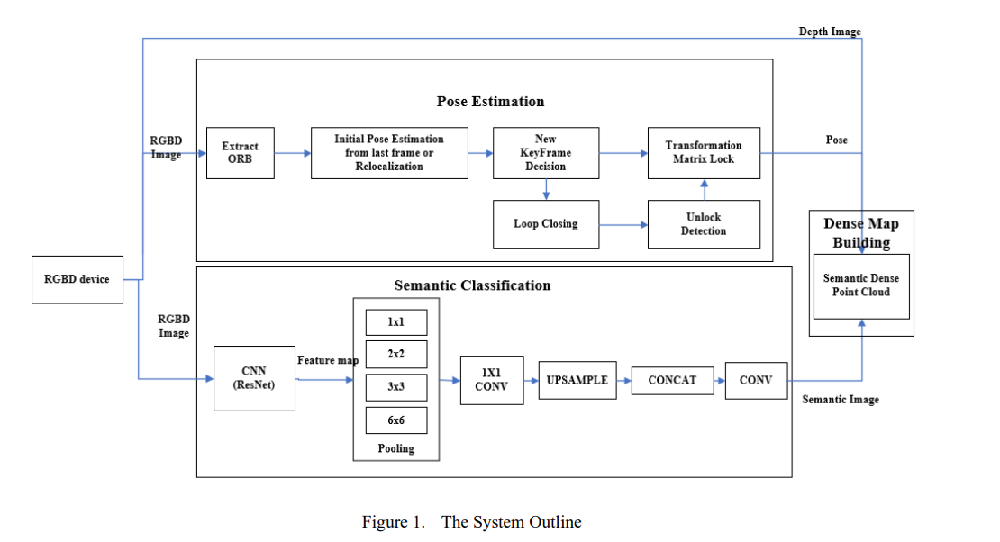

# 论文阅读（SLAM方向

# 3D Semantic Map Construction System Based on Visual SLAM and CNNs（2020

## Abstract

传统的SLAM方法不能从场景中提取语义信息或者满足机器人实现的高级任务，同时3D地图点构建效率也很低。为了解决这个问题，我们提出了一个构建3D语义地图的系统。**首先**，当前相机位姿基于ORB-SLAM算法进行估计和优化，我们可以获得全局的轨道和位姿。**其次，**设计一个语义分割网络来预测每个像素的语义类别。3D语义点云信息通过几何语义信息和物体点云生成。通过VSLAM算法获得的相机全局位姿信息整合到语义点云信息中生成一个3D的语义地图。**最后**，我们使用Octmap八叉树地图来实现导航、地图存储（以减少存储空间）。

## Introduction

论文[1] [2]介绍了SLAM在机器人领域中重要的研究，在没有预先知道环境信息的同时需要评估机器人的姿势和运动。通过传统的VSLAM方法，我们仅仅能获得空间中深度或者稀疏几何信息。这些空间点提供了相关的精确位姿信息，但是没有语义属性信息。然而，为了完成更多更复杂的任务，机器人需要了解周围环境信息，并且能够感知高层次的环境语义信息。例如，如果一个人提出“帮我拿桌子上的杯子”，机器人需要明白“桌子”这个语义概念，以及“杯子”和其周围有关的定位信息。语义地图包含了环境中的空间几何关系，获得语义信息包含例如位置，姿势，物体种类。此外，语义地图可以改善人机交互，帮助机器人处理更复杂的任务。

SLAM算法是语义地图构建的基础，VSLAM包括：直接法和特征法。

- 直接法

  LSD-SLAM[3],通过计算帧与帧之间的变换最小化像素灰度差

- 特征法

  特征法是提起特征点进行匹配的到，特征点通过最小化特征重投影误差来实现。

  PTAM[4]，使用BA完成一个实时的SLAM系统

  基于PTAM的启发，ORB-SLAM[5]是一个基于ORB特征点的SLAM系统，生成稀疏3D重构场景。基于ORB特征点进行追踪，局部构图和重定位，并且进行回环检测以消除累计误差。

然而，这些并不足以获得在复杂任务中需要的相机位置信息。作为语义地图的主要构成，一样冯近年来迅速发展。Long[6]提出了完全的卷积神经网络（FCN），它可以生成像素级别的预测图像并且执行端到端的训练。当前，多数先进的场景分析框架都是基于FCN的。CNN改善了对动态物体的认知能力，大事仍然面临这多样化场景以及无限制的字典问题（场景中物体太多，出现很多新的物体不在字典中，无法识别）。ZHAO[7]提出了PSPNet，它解决了基于FCN模型的一个主要问题，这个问题是**缺少合适的策略利用全局的场景类别线索**。使用一个金字塔池化模型pyramid pooling modul对特征图进行才采样，得到不同的分辨率，之后进行增强以后的更好的全局上下文信息。

Sunderhauf[8]提出了基于CNN的语言场景信息识别，来实现场景分类，该方法通过融合2D类的和相机数据。然而，如果物理不能被识别的时候，只能获得点云的类别属性。Vineet[9]提出了一个在线稠密重构方法，然而他们仅仅关注构建地图和分割，语言信息不能被用于地图构建。Kundu[10]构建了全局包含voxel的CRF模型，通过结合重构和语义标注的3D地图，但是模型很难获得结果。Bao[11]整合相机参数，物体几何信息和物体类别信息，把这些信息真河道Structure From Motion(SFM)问题中已生成地接，但是计算密集的优化问题。SLAM++[12]关注室内场景的地图重构在语义定义的物体层面。已知物体的模型通过使用RGB-D传感器信息被识别和插入，之后这些物体模型被用作路标进行轨迹追踪和建图。[13]提出一个使用传统卷积神经网络的稠密3D语义地图，称为SemanticFusion。该模型使用了ElasticFusion[14]作为SLAM后端并且融合语义信息在每个surfel（点元？）来生成一个基于3D语义地图的surfel。但是点云地图过大，以至于很难用于导航。

在这篇文章中，我们设计了一个**3D 语义地图**构建系统，该系统基于VSLAM以及卷积神经网络，可以使得机器人实现更只能导航任务：

- 首先，我们是用RGB-D相机作为传感器，并且使用ORB-SLAM2算法来评估和优化当前相机位姿
- 之后，使用语义分割算法来感知环境的语义信息以及检测物体的类别和位置
- 在之后，结合物体点云和语义信息生成3D语义点云信息
- 最后，使用通过VSLAM算法估计得到的全局一致相机位姿执行基于voxel的语言融合生成包含几何信息和3D信息的语义地图。

在这篇文章中，我们设计了一个语义分割模型来执行像素级语义分割。同时，我们使用八叉树存储地图，这样可以减少地图的存储空间，同时可以使用在高级别的任务中，例如导航。

## Method

整个的3D语义地图构建系统基于VSLAM和卷积神经网络，结构如下图：

系统的输入是：颜色和深度图像；输出的是：3D语义地图。

- 首先，彩色图像和深度图像输出到两个不同的进程中，一个是VSLAM进程，获取相机每个时刻的位姿（通过相邻帧的特征点匹配）；另一个是语义点云生成进程，它对输入的彩色图像执行语义分割，同时根据输入的深度图像和相机内参生成点云地图。（如果是双目，也可以）语义信息和原始的地图信息一并被加入到生成的点云中。
- 最后，执行基于voxel的语义融合来生成一个八叉树地图，该八叉树地图基于生成的点云。同时，包含几何+语义信息的3D地图构建完成，传输到rviz中进行实时仿真。

### A SLAM MAPPING

提出的语义地图需要当前相机位姿的信息，这些信息可以由SLAM系统提供。在这篇文章中，我们选择ORB-SLAM使用RGB和深度信息用于我们SLAM后端的稀疏追踪。在当前图像帧中的ORB特征点用于匹配先前图像帧的特征点。根据这两个特征点的匹配集合，建立优化问题来计算当前帧的位姿。最后，将计算的相机运动情况广播输入到系统中，并且通过Octomap生成过程被吸收。

### B Object Detection for Semantic Mapping

在这篇文章中，我们使用PSPNet作为我们的CNN模型。

- 首先，图像输入到卷积神经网络中，在特征提取网络中，图像大小为原来的1/8。特征图之后送到金字塔池化模块pyramid pooling module。金字塔池化层被分类四个不同的尺度。
- 在池化之后，获得了不同大小的特征地图。对于每个金字塔级别的特征地图，我们进行1×1的卷积降维，之后直接对低维特征进行上采样，来获得原始图像尺寸大小。
- 最后，不同层的特征图和原始特征图进行合并，来生成特征图，使用最后一次卷积层来生成分类置信图。

在语义构建系统中，语义分割模块提供了最初的语义信息。为了保证整个系统操作的实时性，特别是VSLAM模块，语义分割模型的计算量需要尽可能的减少。因此，我们压缩了语义分割网络结构，并且减少了这篇文章中的模型参数。

论文[15]提出了一个深度可分离的卷积(depthwise separable convolution)来减少模型参数。深度可分离的卷积分解了标准全局来获得深度卷积和1×1的逐点卷积pointwise convolution。如下图：

假设输入的特征图像维度是$$D_F×D_F×M$$，卷积核大小是$$D_k×D_k$$。$$D_F$$和$$D_G$$各自是字输入和输出图像的高和宽。对于一个标准卷积核，卷积计算需要的操作量是$$D_k^2×M×N×D_F^2$$

在使用深度可分离卷积之后，标准卷积核被分成了M个$$D_k×D_k×1$$和N个$$1×1×M$$的卷积核。因此计算开销是：$$D_k^2×M×D_F^2+M×D_F^2$$，因此两种卷积计算值比是：
$$
\frac{D_k^2×M×N×D_F^2}{D_k^2×M×D_F^2+M×D_F^2}=\frac{1}{N}+\frac{1}{D^2_k}
$$
在这篇文章中，我们通过使用MobileNetV2[16]替换Resnet-50修改了了PSPNet-50。MobileNet使用深度可分离卷积的方法减少了模型尺寸并且在图像分割中展现了良好的性能。网络结构如下图所示：

首先，输入图像到MobileNetV2网络中，加速特征图的提取；之后，连接金字塔池化结构；最后通过卷积层输出分割结果。

### C semantic mapping

在通过RGB-D相机获得图像信息之后，之后使用一个系统进行点云生成，语义分割，以及相机位姿估计。在语义分割完成后，将识别得到的颜色分割添加到点云中生成3D语义点云信息。3D语义点云信息包含物体在世界坐标系下的3D坐标以及语义信息。我们使用它构建语义地图。

为了减少地图需要的存储空间，并且允许地图使用于导航任务，我们选择Octomap[17]用于地图存储。Octomap是基于八叉树Octo-tree结构的概率地图，它可以压缩点云以及节省存储空间。八叉树的结构如下图所示：

基于八叉树持续修剪3D空间知道生成最小的正方形。在一个八叉树中，**节点**存储了关于是否被占用的信息。当所有子节点被占用或者没有时，就没有必要在拓展新的节点。使用0~1的浮点数模型来表示方块被占用的概率。

在观察环境的过程中，节点需要进行概率更新，因为观测结果会受到噪声的影响以及动态物体的影响。计算公式如下：
$$
P(n|z_1:T)=(1+\frac{1-P(n|z_T)}{P(n|z_T)}\frac{1-P(n|z_{1:T-1})}{P(n|z_{1:T-1})}\frac{P(n)}{1+P(n)})
$$
n——叶子节点

z~T~——在T时刻测量值

P(n|z~1~:T)——叶子节点被占据的概率

为了保证概率在0~1，上述公式使用log概率形式：
$$
y=log it(x) = log(\frac{x}{1-x})
$$
转换可得：
$$
L(n|z_{1:t+1})=L(n|z_{1:t-1})+L(n|z_t)
$$
最后，当前观测数据持续融合以便更新节点，最后创建Octomap地图。为了在Octomap地图中存储3D点云信息，我们使用以下进程：

1. 计算相机位姿与目标物体之间的自有节点
2. 之后将自由点和3D语义空间点放到地图中，并且更新关联voxel的概率值

同时，通过voxel表示最基本的存储单元，并且每个voxel同步存储占用的概率，以及voxel对应不同物体总类的得分置信度。

在更新八叉树地图的过程中，相同voxel的语言分割可能因为传感器感受到的环境不确定性造成不一致。当在不同帧融合voxel是，不一致的标签将会产生冲突。为了解决这个问题，这篇文章使用Bayesian 融合方法来执行基于voxel的语义标签融合。Bayesian融合广泛用于多视觉语义融合中，公式如下：
$$
p(y|z^i)=\frac{p(z_i|y,z^{i-1})p({y,z^{i-1}})}{p({z_i|z^{i-1}})}
$$
y代表当前voxel的语义标签信息，z~i~代表第i帧中voxel的测量值
$$
p(y|z^i)=η_ip(z_i|y,z^{i-1})p(y|z^{i-1})
$$
我们使用Bayesian融合将voxel作为一个单一帧的基本单元的语义标签，之后标准化来获得有效的概率分布。这种语义概率信息的增量融合使系统能够利用所有现有帧实时更新和优化3D点的语义标签，提高语义标注的准确性。

## EXPERIMENT

系统参数：

- 相机：Xiton Camera
- 操作系统：Ubuntu 系统
- CPU：Intel i7-7800K
- GPU：TITAN Xp

### A Network training

训练数据集：ade20K[18]；batch_size=32，初始学习率：0.001

准确性评估：1、pixel accuracy；2、IoU Score；3、训练时间；4、网络模型大小

通过实验，使用MobileNetV2和PSPNet网络减少了网络模型的1/4，提升了计算速率以及保证了小细节的准确性

### B 3D重建

Xiton相机获取RGB图，使用ORB-SLAM算法计算相机位姿，绘制点云地图并把绘制的点云图结合在一起

### C 语义地图

在实验环境中测试语义地图，通过VSLAM实时获取相机位姿信息，同时语义分割模块获取位姿信息以及物体种类，最后构建Octomap。

## Conclusion

作者使用VSLAM算法，提取特征点进行匹配，得到3D点云地图，同时将图像输入到神经网络中，提取特征，进行语义分割，生成语义地图。将二者进行融合。

但是，作者只是研究了静态环境的问题，但是对于动态环境，论文将进一步研究如何识别并排除他们。同时RGB-D相机仅在论文中使用，并且定位精度取决于相机轨迹。在未来，可以尝试多传感器融合，提高计算精度。

# A New Semantic SLAM Mapping Algorithm Based on Improved YOLOv5

## Abstract

VSLAM使用相机来进行信息输入。在构图过程中，使用几何点云的空间几何信息，这样的信息缺少环境中物体的语义信息。这篇文章提出了一个新的语义算法基于改进的YOLOV5。

- 首先，使用一个Pyramid Scene Parsing Network(PSPNet)分割统计入到YOLOV5中进行环境信息的语义提取。
- 之后，通过ORB-SLAM2估计机器人位姿
- 最后，语义图像、深度图像和位姿变换矩阵一起传输到一个绘图模块，融合一个深度点云语义地图

数据集是KITTI，结合深度地图消除了干扰因素，在大尺度场景中具有准去性和鲁棒性

## Introduction

单纯的SLAM能够定位，但是导航、避障以及交互能力非常差。因此需要语义SLAM对传统SLAM功能进行拓展。语义SLAM不仅仅是获得集合结构信息，也能够分辨在环境中独立的物体来获得其语义信息，例如位置，姿势，功能属性，这样就能够更好的控制复杂场景以及完成更多的只能任务。[1]构建了室内场景的语言融合，是经典的构建像素级语义地图和完整的语义SLAM系统的算法，它结合了传统SLAM与语言分割。它优化了CNN的分割效果，对于单张图片，它是用特征点匹配关系作为输出，显著的改进了语义地图的准确性。**但是算法需要大量的计算资源以及实时性较差**。DA-RNN[2]在视频帧中完成了语义信息的提取，并且整合语义信息到3D图中（通过KinectFusion[3]）。然而，仍然需要花费大量的计算资源。与此同时，尽管算法在一定程度上提高了语义分割的精确度，但是这样的改进是有限的。对于这个问题，研究人员提出了一下轻量级的语义地图构建框架：**SEMANTIC-RTAB-MAP**(SRM)基于RTABMAP[4]和YOLO[5]构建语义地图。并非直接使用深度学习方法，它是用YOLO V2算法粗略估计物体位置，之后是用Canny算符检测深度图像中物体的边界，并且具有regional growth算法处理边界完成精确的物体分割。这个算法改进了语义地图的实时性。构建的基于场景的语义地图，主要使用深度学习方法在3D点点云中绘制2D语义信息。目前，相关技术**关注语义分割方法+语义融合方法**。

一方面，从先前的地图应用，基于场景的语义地图可以协助机器人更好的认知环境。另一方面，考虑算法的效率，这样的算法需要像素级别的语义分割应用在场景中的所有物体之上。语义分割算法的性能好，就可以构建高精度的语义地图。因此这篇文章提出了新的SLAM构图算法，该方法基于YOLO V5，使用GB-D相机数据构建一个室外语义稠密3D场景。文章结构是：

- 第二部分，相关工作
- 第三部分，主要提出的系统模块
- 第四部分，算法和模块评估
- 第五部分，总结

## Related work

### 1.Semantic Extractor

语义信息获取的挑战主要是：**得到物体像素级别的分类准确性**。

早期用于特征点提取和描述子生成的算法：SIFT,SURF,FAST,R-CNN[6]...使用滑动窗口的方法，识别区域，使用CNN对每个区域提取固定长度的新。R-CNN使用SVM进行物体检测，会占用大量内存和计算资源。Fsat R-CNN[7]抛弃了RCNN中的SVM，结合分类与回归任务。作为一个single network，Fast-RCNN实现了端到端的检测以及提升了RCNN的速度。基于Fast-RCNN，Faster-RCNN[8]使用了RPN而不是initial selective算法进行特征提取。它整合了特征提取，建议提取，边界框回归和分类任务到一个网络中，并且它的检测速度有效的改善。

随着持续的目标检测算法的更新，出现了Mask R-CNN[9],YOLO系列，SSD[10]等。**Mask R-CNN**是一个小并且灵活的物体实例分割框架，使用ResNet-FPN架构并且加入了一个mask prediction分支。这个算法加入到了PSPNet[11]作为基于YOLOV5的分类头，具有很好的实时性。

### 2. Advanced SLAM Framework

当前，大多数位姿估计算法依赖于传统的方法，例如几何约束和非线性优化。

- MonoSLAM[12]是用于单目SLAM的实时算法，它是用了一个单目相机恢复机器人在未知场景中运动的3D轨迹。该算法运用场景很窄，因为路标数的限制以及特征点易丢失。
- PTAM[13]提出了一个前端到后端和后端到后端的方法，在构图时使用了并行追踪。PTAM使用了非线性的优化，并且引入了关键帧机制减少了数据量，提高了计算速度。由于PTAM的出现，VSLAM后端优化逐渐变成了非线性优化问题，而不是传统的滤波问题。PTAM的问题在于，受限于场景的尺寸，只用于小场景，并且追踪线程tracking thread容易丢失。
- 现在VSLAM的更多算法，例如Semi-Direct Monocular Visual Odometry(SVO)[14]，Large-Scale Direct monocular SLAM(LSD-SLAM)，Direct Space Odometry(DSO)...
- ORB-SLAM2继承了PTAM的有点，并且通过提取ORB特征作为观测符号极大地提高了计算速度，这样满足要实时性的操作，当前ORB-SLAM2是最受欢迎的SLAM框架。

### 3. Mapping Module

输出一个精确的环境模型是SLAM系统的目标。在定位数据的限制之下，制图模块整合了最初的观测图像或者在虚拟空间的特征点来完成提取匹配和重复数据删除。许多经典SLAM仅仅使用点云的空间几何信息来构建稀疏或者稠密地图。轻量点云地图对地图进行抽象，并且仅仅用于机器人定位。通常稠密点云地图缺少环境中关于物体的语义信息。系统在这篇文章中使用基于改进的YOLO v5模块，这样能够在大规模场景中精确构建语义地图。

## Proposed method(待补充)

## Experiment Result and Analysis(待补充)

## Conclusion

这篇文章提出了一个新的语义地图算法，该算法基于改进的YOLOV5。首先，基于COCO数据集训练一个语义检测器，获取观测的图像以及执行像素级别的物体分割。同时，将RGB-D信息输入到ORB-SLAM2框架中，得到实时的位姿估计。之后，使用位姿估计和排出干扰因素的深度地图，构建3D点云稠密地图。

这篇文章选择了一个合适的基于评估和视觉影响的算法来实现精确的语义分割，这是在绘制准确地图的关键一步。另一方面，地图构建模型实践了精确的**大尺度室外语义地图**，该地图能够很好的用于机器人导航。

系统使用送耦合的方法链接每个模块。因此，通过这个结构，有更好的物体检测和语义分割算法可以随时替换模块中的内容。

# PSPNet-SLAM: A Semantic SLAM Detect Dynamic Object by Pyramid Scene Parsing Network(2020

## Abstract

SLAM是计算机视觉和机器人领域的重要构成。传统的SLAM框架基于很强的动态环境假设，这样可以比较方便的分析问题。了解如何处理动态环境是非常重要的。面对这些挑战，研究者思考引入语义信息来关联解决场景中动态物体的问题。因此，在这篇文章中，我们提出使用了PSPNet-SLAM：**Pyramid Scene Parsing Network SLAM**，它整合了金字塔结构的语义线程以及ORB-SLAM2中的reverse ant colony搜索策略。在我们提出的系统中，一个金字塔结构的PSPNet被用于语义线，以此结合上下文信息分割动态物体。

几何线程中，我们提出了OCMulti-View Geometry线程。一方面，为了提高动态点检测的精度，设计了最佳误差补偿单应矩阵。另一方面，我们提出一个reverse ant colony collection策略来增强系统的实时性以及减少检测动态物体需要消耗的时间。

我们评估我们的SLAM在公开数据将和实时数据集，并且与ORB-SLAM2,DynaSLAM进行比较。许多改进以及在这个系统中实现，包括在高动态场景中的定位准确性，优于当前四个先进的SLAM系统来尝试解决动态环境问题。

## Conclusion

在这篇文章中，我们提出了PSPNet-SLAM系统，减少了PSPNet系统作为并行语义线程，以及基于ORB-SLAM2搭建。

- 在语义线程中，我们使用了PSPNet来获取像素级别的语义分割。更多纹理细节可以通过pyramid-shaped network结构得到，并且可以找到物体像素之间的相互关联信息，它能够有效的检测和删除动态特征点（对比其他卷积网络）。
- 在几何线程中，我们提出了最优错误步长单应矩阵optimal error compensation homography matrix，用于补偿由于之前的帧中的特征点投影转换误差造成的特征点漂移问题。第二，我们提出了reverse ant colony search策略，使用了动态点集权的分布特征来有选择的检测特征点，因此改进了几何线程对于特征点检测的实时性和鲁棒性。
- 为了验证系统性能，我们在TUM数据集进行测试，并且对比其他出众的SLAM系统。最后的实验结果显示我们改进了定位准确性和实时性能。

我们未来需要做的工作：一方面，实时性仍然需要提高。在之后的工作中，需要研究SLAM系统图像帧的实时性处理；在未来的工作中，我们需要把PSPNet-SLAM放到不同数据集中进行实验，对系统进行调整来改进系统删除动态特征的能力。

# Det-SLAM : A semantic visual SLAM for highlt dynamic scenes using Detectron2（2022

## Abstract

SLAM是自动化机器人系统的内核。一些SLAM系统有令人印象深刻的性能，并且已经使用了很长时间。但是，该方向仍然有很多问题仍未解决，例如**如何解决在动态环境下物体运动**。经典的SLAM系统依赖于环境是静态的假设，这样在动态环境下，系统失效。近些年有一些方法尝试解决这个问题，但是每个方法都有其局限性。本研究结合了视觉SLAM系统**ORB-SLAM3和Detectron2**来生成一个Det-system，该系统使用了深度信息辨别和消除动态点，完成动态环境中的语义SLAM。我们在TUM公开数据集进行评估，Det-SLAM的性能更好，并且室内动态场景出错率更低。

## Conslusion

在这个研究中，我们提出了一个新的算法，Det-SLAM，通过Detectron2完成目标检测和语义分割。

Detectron2是一个更为精确的模型。在语义分割任务中，类之间的标签的关系如果是通过全连接网络得到的，那么这些标签可能丢失。另外，它可能会忽略小物体或者零星的识别大物体。Det-SLAM使得现有的SLAM更具鲁棒性，并且减少了动态物体对于位姿评估的影响。尽管我们的方法能够成功的在TUM RGB-D数据集上运行，其仍然有一些缺点，对比其他算法。

我们在比较算法中，用图像处理技术而不是几何约束。因此计算量减少了。虽然我们没有比较算法的执行时间，我们的方法可以在一个普通的PC桌面上执行。从其他视角看，在这个过程中，我们舍弃了基于条件的许多视觉信息，这导致了在追踪帧中的轨迹遇到的错误以及遗失了许多序列。因此，该系统不能应用在室外环境，或者快速的相机运动。

这个算法提供了一些优势对比之前的算法。使用在DS-SLAM中的SegNet易受重叠物体的影响，它导致了最后结果的误差。然而，该问题对我们的算法不能造成特别的影响。此外，我们使用了ORB-SLAM3而不是ORB2，这优化了关键帧的处理。该方法也有使用IMU的可能性。未来的工作可能包含优化实时性能，IMU数据用来步长丢失的信息，并且有更多的图像处理方法用于将前景与输入图像分离。

# Research on Vision-based Semantic SLAM towards Indoor Dynamic Environment(2022

## Abstract

多数地图基于传统视觉SLAM技术构造，这些地图多数是sparse稀疏地图，这些仅包含集合信息，并不包含语义信息，因此，机器人完成感知任务会被限制。在这篇文章中，我们提出一个基于视觉的语义SLAM方法。通过使用语义信息优化视觉里程计，来溢出场景中动态信息的影响。基于提出的方法我们完成了语义地图的构建。

## Conclusion

为了解决传统SLAM中存在的问题，我们结合了传统的VSLAM和深度学习。使用语义信息，追踪线程从两个方面进行优化：

- 添加动态的整点检测模块，将语义信息与多约束方法的几何约束结合，删除动态特征点；
- 设计关键帧选择方法避免计算静态特征点的共同视觉索引而导致的轨迹损失

使用选出的关键帧，构建一个像素级点云语义地图。地图给每个像素点添加了语义信息，同时删除了动态区域

# SDF-SLAM：Semantic Depth Filter SLAM for Dynamic Environments（Buaa 2020

## Abstract

SLAM被广泛应用在计算机视觉和机器人领域。对于在现实生活中非常普遍的动态环境，传统的VSLAM系统对于定位和制图的准确性降低，因为传统SLAM基于**动态环境的**假设。最近，语义VSLAM系统对于动态环境的应用是吸引了越来越多的关注，使用了图像的语义信息帮助减少了特征点。现有的语义VSLAM系统通常根据语义先验semantic prior，几何约束或者二者结合，检测动态特征点，之后删除关联地图点的动态特征点。在VSLAM框架中，3D地图点周围的位姿计算至关重要，因此改进SLAM系统的关键在于建立更为准确和可靠的地图。现有的语义VSLAM系统实时上直接用于获得可靠的地图点，并且有少许问题存在。在这篇文章中，我们提出了一个SDF-SLAM：Semantic Depth Filter SLAM，一个语义VSLAM对于动态环境，该系统使用了深度滤波器直接判断3D地图点是否是动态的：

1. 首先，语义信息被整合到原始的纯几何SLAM系统，通过使用语义光流来进行可靠的地图初始化
2. 设计一个语义深度滤波器，该滤波器满足高斯均匀Gaussian Uniform混合分布来描述每个地图点的 the inverse depth反深度
3. 在一个贝叶斯估计框架中，更新3D地图点的 the inverse depth反深度，并且将这个3D地图划分为活跃度和不活跃的两张图。
4. 最后，使用活跃度地图点来实现相机轨迹追踪的鲁棒性。

## Conclusion AND DICUSSIONS

我们提出了一个新的语义VSLAM，SDF-SLAM，对于动态环境。它是基于ORB-SLAM2大家的，并且从3D地图点使用贝叶斯滤波框架直接检测动态环境。其中有两个模块，一个模块是语义地图初始化模块，该模型使用语义光流，另一个模型是动态地图点检测模块，该模块使用反深度滤波，被引入到ORB-SLAM2框架中。我们的系统可以可恶动态特征点在2D图像层面探测的缺点，并且能够检测到更可靠的物体动态特征。

我们的实验是在TUM数据集上进行的，证明了我们的方法在动态场景方面由于ORB-SLAM2和其他先进的语义SLAM系统。

我们的工作之后有以下改进方面：

1. 退化场景，例如几何响应退化（例如，所有观测的特征共面或者在一个规则的a ruled quadric二次曲面）或者相机运动退化问题（例如纯旋转）
2. 需要更深或者细节研究基于需要映射点的反深度的收敛性质
3. 我们的方法符合了经典的ORB图像特征在整个SLAM框架中。随着深度学习应用在特征提取技术上的发展，例如MagicPoint[27]和GCN[28]特征，在未来我们使用深度学习特征代替ORB特征来改进系统的鲁棒性和准确性

# SPNet: Superpixel Pyramid Network for Scene Parsing

## Abstract

场景分析是计算机视觉研究重要的一部分。并且深度coding-decoding网络广泛应用在场景分析中。然而，这里仍然有一些问题，例如物体分割时边界的模糊问题以及在场景分析中小物体分割的不确定性。在这篇文章中，我们提出了Superpixel Pyramid网络用于场景分析。

1. 首先，使用一个深度coding-decoding网络来获得图像特征
2. 之后，使用多尺度空间金字塔结构增强小尺度图像表现
3. 在之后，Superpixel Segmentation超像素图像分割解决物体边界模糊的问题
4. 最后，两次神经网络分类应用在逐个像素辨别特征融合

## Conclusion

结论，我们提出了一个超像素金字塔网络用于场景分析。

1. 首先，通过超像素分割方法分割原始图像，物体的边缘信息被明确，补充了传统深度编译码网络结构中的边缘模糊
2. 使用空间金字塔池化结构，完成相同形状或尺寸的全局或者局部信息融合，同时也解决包括一些场景中小物体的分割困难。这增加了额外的空间纹理信息，增强了使用在整个场景使用全局信息以及改进了对场景认知理解的能力。拓展实验关注场景分析和语义分割，展现了我们的方法可以获得的更好的性能。

# 附录：

因为在实验中，很多框架都使用了PSPNet，这里给出[PSPNet相关资料]([[论文笔记\] PSPNet：Pyramid Scene Parsing Network - 知乎 (zhihu.com)](https://zhuanlan.zhihu.com/p/115004020))，相关论文在“语义分割”文件夹下

**不同语义分割方法**

**解决语义分割结果的一些问题：**响应速度，小物体不确定、边界模糊

**数据集实验：**TUM
