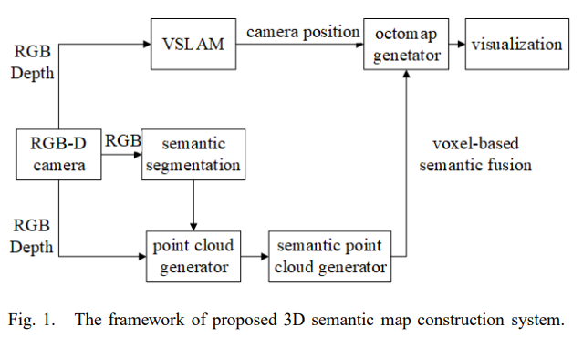
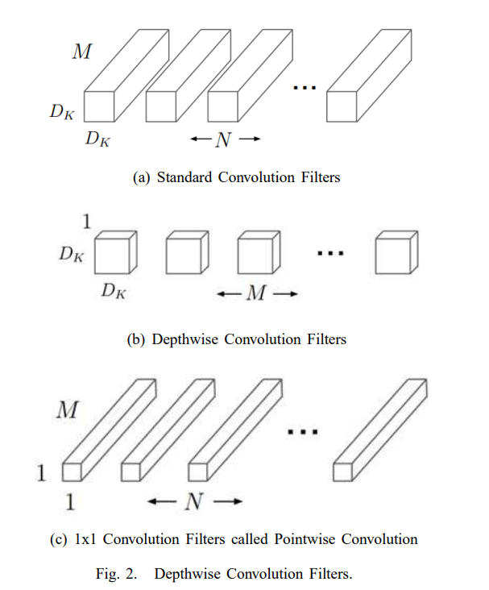
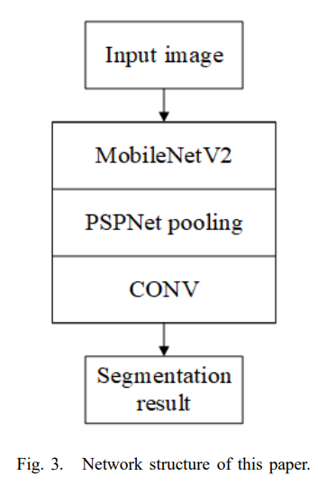
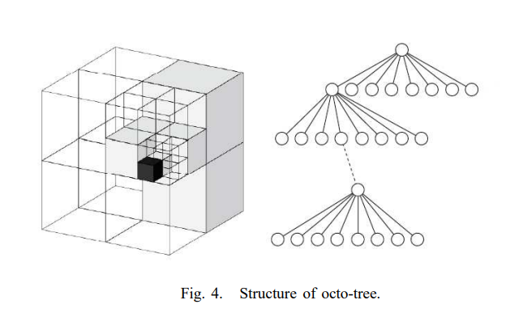

# 论文阅读（SLAM方向

# 3D Semantic Map Construction System Based on Visual SLAM and CNNs（2020

## Abstract

传统的SLAM方法不能从场景中提取语义信息或者满足机器人实现的高级任务，同时3D地图点构建效率也很低。为了解决这个问题，我们提出了一个构建3D语义地图的系统。**首先**，当前相机位姿基于ORB-SLAM算法进行估计和优化，我们可以获得全局的轨道和位姿。**其次，**设计一个语义分割网络来预测每个像素的语义类别。3D语义点云信息通过几何语义信息和物体点云生成。通过VSLAM算法获得的相机全局位姿信息整合到语义点云信息中生成一个3D的语义地图。**最后**，我们使用Octmap八叉树地图来实现导航、地图存储（以减少存储空间）。

## Introduction

论文[1] [2]介绍了SLAM在机器人领域中重要的研究，在没有预先知道环境信息的同时需要评估机器人的姿势和运动。通过传统的VSLAM方法，我们仅仅能获得空间中深度或者稀疏几何信息。这些空间点提供了相关的精确位姿信息，但是没有语义属性信息。然而，为了完成更多更复杂的任务，机器人需要了解周围环境信息，并且能够感知高层次的环境语义信息。例如，如果一个人提出“帮我拿桌子上的杯子”，机器人需要明白“桌子”这个语义概念，以及“杯子”和其周围有关的定位信息。语义地图包含了环境中的空间几何关系，获得语义信息包含例如位置，姿势，物体种类。此外，语义地图可以改善人机交互，帮助机器人处理更复杂的任务。

SLAM算法是语义地图构建的基础，VSLAM包括：直接法和特征法。

- 直接法

  LSD-SLAM[3],通过计算帧与帧之间的变换最小化像素灰度差

- 特征法

  特征法是提起特征点进行匹配的到，特征点通过最小化特征重投影误差来实现。

  PTAM[4]，使用BA完成一个实时的SLAM系统

  基于PTAM的启发，ORB-SLAM[5]是一个基于ORB特征点的SLAM系统，生成稀疏3D重构场景。基于ORB特征点进行追踪，局部构图和重定位，并且进行回环检测以消除累计误差。

然而，这些并不足以获得在复杂任务中需要的相机位置信息。作为语义地图的主要构成，一样冯近年来迅速发展。Long[6]提出了完全的卷积神经网络（FCN），它可以生成像素级别的预测图像并且执行端到端的训练。当前，多数先进的场景分析框架都是基于FCN的。CNN改善了对动态物体的认知能力，大事仍然面临这多样化场景以及无限制的字典问题（场景中物体太多，出现很多新的物体不在字典中，无法识别）。ZHAO[7]提出了PSPNet，它解决了基于FCN模型的一个主要问题，这个问题是**缺少合适的策略利用全局的场景类别线索**。使用一个金字塔池化模型pyramid pooling modul对特征图进行才采样，得到不同的分辨率，之后进行增强以后的更好的全局上下文信息。

Sunderhauf[8]提出了基于CNN的语言场景信息识别，来实现场景分类，该方法通过融合2D类的和相机数据。然而，如果物理不能被识别的时候，只能获得点云的类别属性。Vineet[9]提出了一个在线稠密重构方法，然而他们仅仅关注构建地图和分割，语言信息不能被用于地图构建。Kundu[10]构建了全局包含voxel的CRF模型，通过结合重构和语义标注的3D地图，但是模型很难获得结果。Bao[11]整合相机参数，物体几何信息和物体类别信息，把这些信息真河道Structure From Motion(SFM)问题中已生成地接，但是计算密集的优化问题。SLAM++[12]关注室内场景的地图重构在语义定义的物体层面。已知物体的模型通过使用RGB-D传感器信息被识别和插入，之后这些物体模型被用作路标进行轨迹追踪和建图。[13]提出一个使用传统卷积神经网络的稠密3D语义地图，称为SemanticFusion。该模型使用了ElasticFusion[14]作为SLAM后端并且融合语义信息在每个surfel（点元？）来生成一个基于3D语义地图的surfel。但是点云地图过大，以至于很难用于导航。

在这篇文章中，我们设计了一个**3D 语义地图**构建系统，该系统基于VSLAM以及卷积神经网络，可以使得机器人实现更只能导航任务：

- 首先，我们是用RGB-D相机作为传感器，并且使用ORB-SLAM2算法来评估和优化当前相机位姿
- 之后，使用语义分割算法来感知环境的语义信息以及检测物体的类别和位置
- 在之后，结合物体点云和语义信息生成3D语义点云信息
- 最后，使用通过VSLAM算法估计得到的全局一致相机位姿执行基于voxel的语言融合生成包含几何信息和3D信息的语义地图。

在这篇文章中，我们设计了一个语义分割模型来执行像素级语义分割。同时，我们使用八叉树存储地图，这样可以减少地图的存储空间，同时可以使用在高级别的任务中，例如导航。

## Method

整个的3D语义地图构建系统基于VSLAM和卷积神经网络，结构如下图：

系统的输入是：颜色和深度图像；输出的是：3D语义地图。

- 首先，彩色图像和深度图像输出到两个不同的进程中，一个是VSLAM进程，获取相机每个时刻的位姿（通过相邻帧的特征点匹配）；另一个是语义点云生成进程，它对输入的彩色图像执行语义分割，同时根据输入的深度图像和相机内参生成点云地图。（如果是双目，也可以）语义信息和原始的地图信息一并被加入到生成的点云中。
- 最后，执行基于voxel的语义融合来生成一个八叉树地图，该八叉树地图基于生成的点云。同时，包含几何+语义信息的3D地图构建完成，传输到rviz中进行实时仿真。

### A SLAM MAPPING

提出的语义地图需要当前相机位姿的信息，这些信息可以由SLAM系统提供。在这篇文章中，我们选择ORB-SLAM使用RGB和深度信息用于我们SLAM后端的稀疏追踪。在当前图像帧中的ORB特征点用于匹配先前图像帧的特征点。根据这两个特征点的匹配集合，建立优化问题来计算当前帧的位姿。最后，将计算的相机运动情况广播输入到系统中，并且通过Octomap生成过程被吸收。

### B Object Detection for Semantic Mapping

在这篇文章中，我们使用PSPNet作为我们的CNN模型。

- 首先，图像输入到卷积神经网络中，在特征提取网络中，图像大小为原来的1/8。特征图之后送到金字塔池化模块pyramid pooling module。金字塔池化层被分类四个不同的尺度。
- 在池化之后，获得了不同大小的特征地图。对于每个金字塔级别的特征地图，我们进行1×1的卷积降维，之后直接对低维特征进行上采样，来获得原始图像尺寸大小。
- 最后，不同层的特征图和原始特征图进行合并，来生成特征图，使用最后一次卷积层来生成分类置信图。

在语义构建系统中，语义分割模块提供了最初的语义信息。为了保证整个系统操作的实时性，特别是VSLAM模块，语义分割模型的计算量需要尽可能的减少。因此，我们压缩了语义分割网络结构，并且减少了这篇文章中的模型参数。

论文[15]提出了一个深度可分离的卷积(depthwise separable convolution)来减少模型参数。深度可分离的卷积分解了标准全局来获得深度卷积和1×1的逐点卷积pointwise convolution。如下图：

假设输入的特征图像维度是$$D_F×D_F×M$$，卷积核大小是$$D_k×D_k$$。$$D_F$$和$$D_G$$各自是字输入和输出图像的高和宽。对于一个标准卷积核，卷积计算需要的操作量是$$D_k^2×M×N×D_F^2$$

在使用深度可分离卷积之后，标准卷积核被分成了M个$$D_k×D_k×1$$和N个$$1×1×M$$的卷积核。因此计算开销是：$$D_k^2×M×D_F^2+M×D_F^2$$，因此两种卷积计算值比是：
$$
\frac{D_k^2×M×N×D_F^2}{D_k^2×M×D_F^2+M×D_F^2}=\frac{1}{N}+\frac{1}{D^2_k}
$$
在这篇文章中，我们通过使用MobileNetV2[16]替换Resnet-50修改了了PSPNet-50。MobileNet使用深度可分离卷积的方法减少了模型尺寸并且在图像分割中展现了良好的性能。网络结构如下图所示：

首先，输入图像到MobileNetV2网络中，加速特征图的提取；之后，连接金字塔池化结构；最后通过卷积层输出分割结果。

### C semantic mapping

在通过RGB-D相机获得图像信息之后，之后使用一个系统进行点云生成，语义分割，以及相机位姿估计。在语义分割完成后，将识别得到的颜色分割添加到点云中生成3D语义点云信息。3D语义点云信息包含物体在世界坐标系下的3D坐标以及语义信息。我们使用它构建语义地图。

为了减少地图需要的存储空间，并且允许地图使用于导航任务，我们选择Octomap[17]用于地图存储。Octomap是基于八叉树Octo-tree结构的概率地图，它可以压缩点云以及节省存储空间。八叉树的结构如下图所示：

基于八叉树持续修剪3D空间知道生成最小的正方形。在一个八叉树中，**节点**存储了关于是否被占用的信息。当所有子节点被占用或者没有时，就没有必要在拓展新的节点。使用0~1的浮点数模型来表示方块被占用的概率。

在观察环境的过程中，节点需要进行概率更新，因为观测结果会受到噪声的影响以及动态物体的影响。计算公式如下：
$$
P(n|z_1:T)=(1+\frac{1-P(n|z_T)}{P(n|z_T)}\frac{1-P(n|z_{1:T-1})}{P(n|z_{1:T-1})}\frac{P(n)}{1+P(n)})
$$
n——叶子节点

z~T~——在T时刻测量值

P(n|z~1~:T)——叶子节点被占据的概率

为了保证概率在0~1，上述公式使用log概率形式：
$$
y=log it(x) = log(\frac{x}{1-x})
$$
转换可得：
$$
L(n|z_{1:t+1})=L(n|z_{1:t-1})+L(n|z_t)
$$
最后，当前观测数据持续融合以便更新节点，最后创建Octomap地图。为了在Octomap地图中存储3D点云信息，我们使用以下进程：

1. 计算相机位姿与目标物体之间的自有节点
2. 之后将自由点和3D语义空间点放到地图中，并且更新关联voxel的概率值

同时，通过voxel表示最基本的存储单元，并且每个voxel同步存储占用的概率，以及voxel对应不同物体总类的得分置信度。

在更新八叉树地图的过程中，相同voxel的语言分割可能因为传感器感受到的环境不确定性造成不一致。当在不同帧融合voxel是，不一致的标签将会产生冲突。为了解决这个问题，这篇文章使用Bayesian 融合方法来执行基于voxel的语义标签融合。Bayesian融合广泛用于多视觉语义融合中，公式如下：
$$
p(y|z^i)=\frac{p(z_i|y,z^{i-1})p({y,z^{i-1}})}{p({z_i|z^{i-1}})}
$$
y代表当前voxel的语义标签信息，z~i~代表第i帧中voxel的测量值
$$
p(y|z^i)=η_ip(z_i|y,z^{i-1})p(y|z^{i-1})
$$
我们使用Bayesian融合将voxel作为一个单一帧的基本单元的语义标签，之后标准化来获得有效的概率分布。这种语义概率信息的增量融合使系统能够利用所有现有帧实时更新和优化3D点的语义标签，提高语义标注的准确性。

## EXPERIMENT

系统参数：

- 相机：Xiton Camera
- 操作系统：Ubuntu 系统
- CPU：Intel i7-7800K
- GPU：TITAN Xp

### A Network training

训练数据集：ade20K[18]；batch_size=32，初始学习率：0.001

准确性评估：1、pixel accuracy；2、IoU Score；3、训练时间；4、网络模型大小

通过实验，使用MobileNetV2和PSPNet网络减少了网络模型的1/4，提升了计算速率以及保证了小细节的准确性

### B 3D重建

Xiton相机获取RGB图，使用ORB-SLAM算法计算相机位姿，绘制点云地图并把绘制的点云图结合在一起

### C 语义地图

在实验环境中测试语义地图，通过VSLAM实时获取相机位姿信息，同时语义分割模块获取位姿信息以及物体种类，最后构建Octomap。

## Conclusion

作者使用VSLAM算法，提取特征点进行匹配，得到3D点云地图，同时将图像输入到神经网络中，提取特征，进行语义分割，生成语义地图。将二者进行融合。

但是，作者只是研究了静态环境的问题，但是对于动态环境，论文将进一步研究如何识别并排除他们。同时RGB-D相机仅在论文中使用，并且定位精度取决于相机轨迹。在未来，可以尝试多传感器融合，提高计算精度。
